<!-- _class: title -->

AI4C2 · research foundations

# Beyond the Model

Harnesses and Architectures for Language Agents

Charles F. Vardeman II 
Center for Research Computing, University of Notre Dame 
August 18, 2026

<!--
Frame the talk as a progression from a language model to an engineered agent system.
The goal is a shared vocabulary and a concrete first research experiment.
-->

---

Language models

## An LLM predicts a continuation

A large language model maps the tokens already in its context to probabilities for what token should come next.

  
<h3>Context</h3>
Instructions, examples, retrieved information, and the conversation so far.

  
<h3>Model</h3>
A trained neural network transforms that context into a distribution over tokens.

  
<h3>Continuation</h3>
Sampling one token at a time produces text—and can request structured tool calls.

<!--
Use Karpathy's video as the recommended deeper introduction. The base operation is still
next-token prediction, even when the resulting behavior looks rich.
-->

---

Further viewing

## Build the full mental model—from tokens to ChatGPT

  
  

    Andrej Karpathy · recommended introduction
    <h3>Deep Dive into LLMs like ChatGPT</h3>
    <ul>
      <li>How text becomes tokens and next-token predictions</li>
      <li>How pretraining and post-training shape behavior</li>
      <li>Why tools and agent loops extend the base model</li>
    </ul>
  

<a href="https://youtu.be/7xTGNNLPyMI">Watch: “Deep Dive into LLMs like ChatGPT”</a> · long-form visual introduction.

<!--
Offer this as the comprehensive optional introduction. It supplies the mental model for
tokens, training, inference, tool use, and agentic behavior that the rest of the deck then
separates into individual architectural layers.
-->

<!--

Tool anatomy

## A tool connects language to an ordinary function

The model is shown a machine-readable contract. The harness connects that contract to executable code.

  

    <pre><code>name: search_reports
description: Find relevant reports
input_schema:
  query:  string
  limit:  integer

# bound by the harness to:
implementation: search_reports(query, limit)</code></pre>
    
The contract enters model context; the implementation remains outside the model.

  

  <ul class="clean-list">
    <li class="teal-dot"><strong>Language-facing contract</strong> Name, purpose, arguments, types, and constraints create a vocabulary for requesting action.</li>
    <li><strong>Harness binding</strong> Maps the advertised name to Python, JavaScript, a database query, a command, or an API.</li>
    <li class="amber-dot"><strong>Structured boundary</strong> Arguments and results cross as data—not as unconstrained executable prose.</li>
  </ul>

<!--
The tool is not a special kind of reasoning inside the model. It is an interface boundary.
The harness owns the binding to local code, a service, a database, or another executable system.
-->

---

<!-- _class: compact-title -->

Tool execution

## The model requests an action; the harness executes it

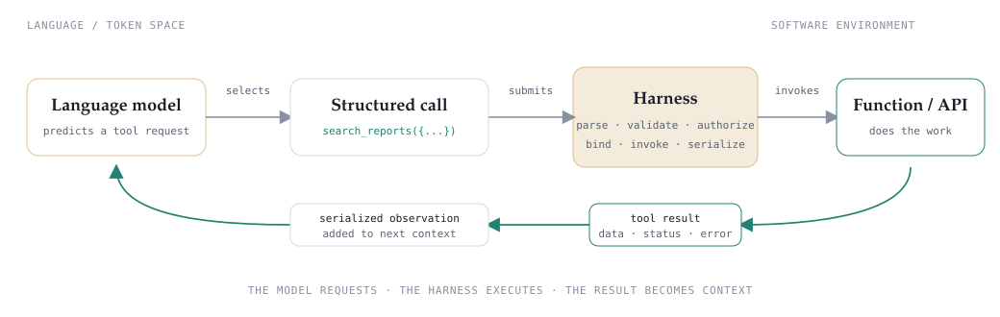

The LLM proposes the call. The harness mediates every crossing of the language–software boundary.

<!--
The model emits tokens in a constrained structured form; it does not directly run Python
or reach a network. Errors are observations too, allowing the model to revise its request.
-->

---

From generation to action

## An agent puts tools in a loop

“An LLM agent runs tools in a loop to achieve a goal.”

  
<h3>1 · Goal</h3>
A bounded objective and a condition for stopping.

  
<h3>2 · Tools</h3>
Actions that retrieve information or change an external environment.

  
<h3>3 · Feedback</h3>
Tool results return as observations that shape the next model call.

Definition: <a href="https://simonwillison.net/2025/Sep/18/agents/">Simon Willison, “I think ‘agent’ may finally have a widely enough agreed upon definition.”</a>

<!--
The loop supplies short-term memory through its interaction history. Long-term memory
enters through additional stores and tools controlled by the harness.
-->

---

<!-- _class: compact-title -->

Training dynamics

## Memorization and generalization can arrive at different times

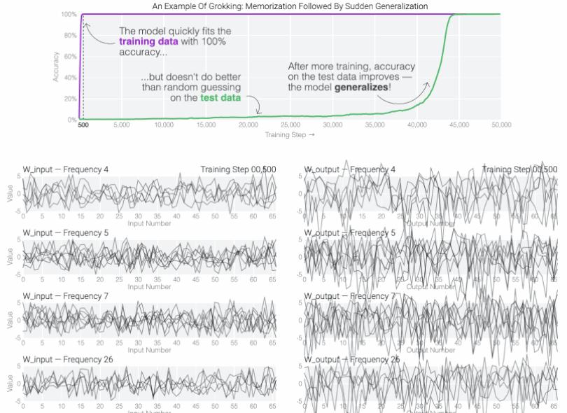

Animation: <a href="https://pair.withgoogle.com/explorables/grokking/">Pearce et al., “Do Machine Learning Models Memorize or Generalize?”</a> · phenomenon: <a href="https://arxiv.org/abs/2201.02177">Power et al., “Grokking.”</a>

<!--
Grokking is a controlled phenomenon, demonstrated most clearly on small algorithmic
tasks. Let the animation carry the explanation: memorization arrives early, internal
structure develops during the apparent plateau, and held-out generalization arrives late.
-->

---

<!-- _class: compact-title -->

Inference-time adaptation

## Examples in the prompt teach a temporary task

  

    Task · sentiment classification
    
Decide whether a review expresses a <strong>positive</strong> or <strong>negative</strong> opinion.

  

  

    <small>PROMPT</small>
    
Classify each review as <strong>POSITIVE</strong> or <strong>NEGATIVE</strong>.

    
<q>I loved this movie.</q><b>POSITIVE</b>

    
<q>This was terrible.</q><b class="negative">NEGATIVE</b>

    
<q>Surprisingly enjoyable.</q>?

  

  
→

  

    <small>MODEL COMPLETION</small>
    <strong>POSITIVE</strong>
  

<strong>No retraining:</strong> the examples shape behavior only while they remain in the prompt.

In-context learning: <a href="https://arxiv.org/abs/2005.14165">Brown et al., “Language Models are Few-Shot Learners”</a> · <a href="https://arxiv.org/abs/2208.01066">Garg et al., “What Can Transformers Learn In-Context?”</a>

<!--
Sentiment classification means deciding whether a statement expresses a positive or
negative opinion. The examples show both what the task is and how the answer should be
formatted. The model uses that information without updating its trained parameters.
-->

---

<!-- _class: compact-title -->

Inside the transformer

## An induction head finds a pattern and continues it

An <strong>attention head</strong> is a small part of a transformer that decides which earlier words are useful for predicting the next one.

  

    <small>EARLIER IN THE PROMPT</small>
    <mark>The code word is</mark> <b>BLUEBIRD</b>.
  

  
look back at what followed the same words

  

    <small>LATER IN THE PROMPT</small>
    <mark>The code word is</mark> <i>→</i> <b>BLUEBIRD</b>
  

  
<strong>1</strong>Find a familiar sequence

  
<strong>2</strong>See what followed it earlier

  
<strong>3</strong>Use that continuation again

Mechanistic evidence: <a href="https://transformer-circuits.pub/2022/in-context-learning-and-induction-heads/index.html">Olsson et al., “In-context Learning and Induction Heads.”</a>

<!--
The repeated phrase is highlighted in amber; the copied continuation is teal. This
match-and-continue behavior is called induction. It helps explain some in-context learning,
but it is not a complete explanation of every capability in a modern language model.
-->

---

Continue learning

## Three visual explanations worth watching

  <a class="video-card" href="https://youtu.be/VkHfRKewkWw">
    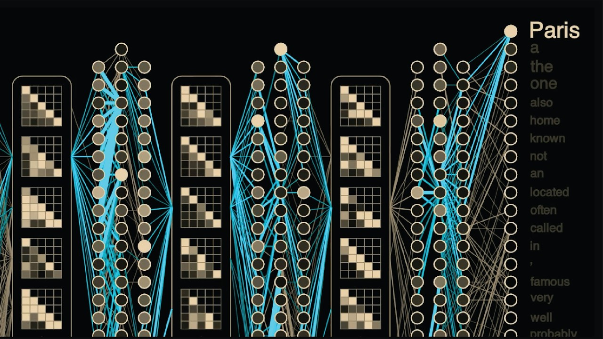
    1 · How training works
    <h3>The F=ma of Artificial Intelligence</h3>
    
Backpropagation and how training changes a model’s weights.

  </a>
  <a class="video-card" href="https://youtu.be/qx7hirqgfuU">
    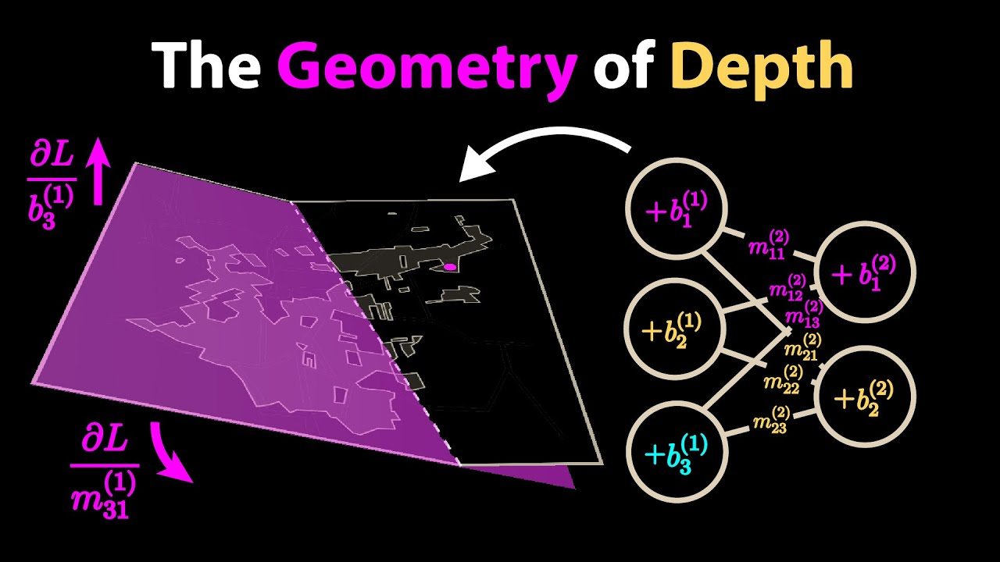
    2 · Why depth helps
    <h3>Why Deep Learning Works Unreasonably Well</h3>
    
A visual account of deep networks and generalization.

  </a>
  <a class="video-card" href="https://youtu.be/D8GOeCFFby4">
    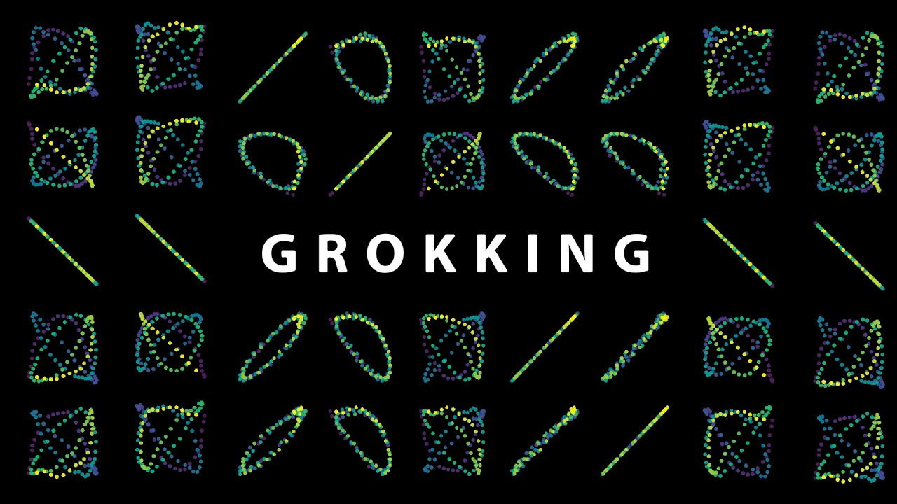
    3 · Looking inside
    <h3>The Most Complex Model We Actually Understand</h3>
    
Grokking and a rare mechanistic explanation of a learned algorithm.

  </a>

All three videos: <strong>Welch Labs</strong> · companion <a href="https://res.cloudinary.com/lesswrong-2-0/image/upload/f_auto,q_auto/v1/mirroredImages/XpCnhaAQrssq8tJBG/rfpm8jhcd5kog1mqi8jn">grokking animation</a>

<!--
Offer these as an optional sequence rather than required preparation. The first explains
how weights change during training; the second builds intuition for deep learning and
generalization; the third connects grokking to mechanistic interpretability.
-->

---

<!-- _class: compact-title -->

Statistical-mechanics aside

## Grokking may resemble slow glass relaxation—not a first-order transition

Treat the neural network as a physical system: its parameters are the degrees of freedom, and training loss plays the role of energy.

  
<strong>Glass physics</strong>atoms rearrange

  
<small>LIQUID</small><b>mobile configurations</b>

  
rapid quench→

  
<small>NONEQUILIBRIUM GLASS</small><b>motion becomes sluggish</b>

  
slow relaxation→

  
<small>STABLE CONFIGURATION</small><b>more equilibrated</b>

  
<strong>Neural network</strong>parameters change

  
<small>EARLY TRAINING</small><b>many possible solutions</b>

  
fast optimization→

  
<small>MEMORIZATION</small><b>low loss; poor test accuracy</b>

  
continued training→

  
<small>GENERALIZATION</small><b>high test accuracy</b>

  <strong>No entropy barrier observed</strong>
  The sampled landscape is continuous between memorizing and generalizing states—evidence against a first-order transition in these experiments.

Zhang et al., <a href="https://neurips.cc/virtual/2025/loc/san-diego/poster/117824">“Is Grokking a Computational Glass Relaxation?”</a> NeurIPS 2025 · scope: one-layer transformers on modular-arithmetic tasks.

<!--
This is a statistical-mechanics analogy backed by an entropy-landscape calculation, not a
claim that every neural network literally undergoes a glass transition. The authors map
parameters to degrees of freedom and training loss to energy. They find no entropy barrier,
arguing against a first-order phase transition in their setup. Their Wang-Landau-inspired
WanD optimizer reaches generalization without the long grokking delay.
-->

---

From model to system

## Capability is moving outward

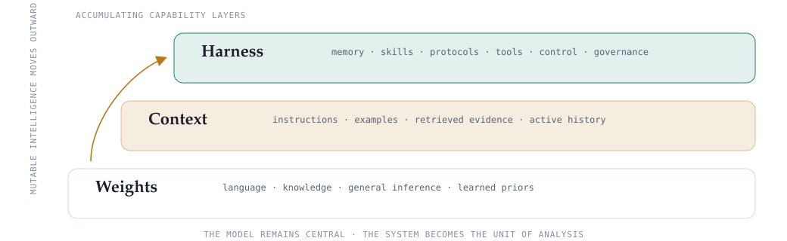

Adapted from <a href="https://arxiv.org/html/2604.08224v1">Zhou et al., “Externalization in LLM Agents,” Fig. 2 and §2.</a>

<!--
The layers accumulate rather than replace one another. The question shifts from “what can
the model do?” toward “what environment lets the model act reliably over time?”
-->

---

Externalization

## Reliable agency relocates recurring burdens

  
Memory<h3>Recall → recognition</h3>
Persist state outside the model and retrieve what the present decision needs.

  
Skills<h3>Generation → composition</h3>
Package procedures so workflows need not be improvised from scratch.

  
Protocols<h3>Ad hoc → structured</h3>
Turn ambiguous interaction into machine-readable, governable exchange.

Organizing principle: <a href="https://arxiv.org/html/2604.08224v1">Zhou et al., “Externalization in LLM Agents,” §1.</a>

<!--
Each artifact transforms the task presented to the model: retrieve rather than recall,
compose rather than reinvent, and fill a contract rather than negotiate an interface in prose.
-->

---

Externalized state

## Memory carries continuity across time

  
<h3>Working context</h3>
Plans, open files, hypotheses, and checkpoints for the active task.

  
<h3>Episodic experience</h3>
Prior trajectories, decisions, failures, outcomes, and reflections.

  
<h3>Semantic knowledge</h3>
Stable facts, project conventions, abstractions, and domain guidance.

  
<h3>Personalized memory</h3>
User- or environment-specific preferences with distinct retention rules.

Sources: <a href="https://arxiv.org/html/2604.08224v1#S3">Zhou et al., §3 and Fig. 4</a> · <a href="https://www.anthropic.com/engineering/effective-context-engineering-for-ai-agents">Anthropic, “Effective context engineering for AI agents.”</a>

<!--
Memory is not synonymous with a vector database. The harness decides what is recorded,
consolidated, forgotten, and loaded into the finite working context at each step.
-->

---

Externalized expertise

## Skills make procedures reusable and inspectable

  
<h3>Operational procedure</h3>
Steps, dependencies, recovery paths, and stopping conditions.

  
<h3>Decision heuristics</h3>
Rules for choosing tools, strategies, or branches under recurring conditions.

  
<h3>Normative constraints</h3>
Required checks, prohibited actions, quality standards, and escalation rules.

authoreddistilleddiscoveredcomposed→ registry → progressive disclosure → execution

Source: <a href="https://arxiv.org/html/2604.08224v1#S4">Zhou et al., §4 and Fig. 5.</a>

<!--
A skill is not merely a tool description. It packages expertise for a class of tasks.
Progressive disclosure keeps only a summary resident until the detailed procedure is needed.
-->

---

Externalized interaction

## Protocols govern how capabilities cross boundaries

  
<h3>Invocation grammar</h3>
Arguments, types, ordering, result shape, and validation.

  
<h3>Lifecycle semantics</h3>
Allowed transitions, turn ownership, completion, and failure.

  
<h3>Permission and trust</h3>
Who may act, what data may move, and which evidence is required.

  
<h3>Discovery metadata</h3>
Registries and capability descriptions make interfaces findable.

Tools expose operations · skills encode how to use them · protocols govern interaction. <a href="https://arxiv.org/html/2604.08224v1#S5">Zhou et al., §5 and Fig. 6.</a>

<!--
Return to search_reports. Its schema is the invocation grammar, but a complete protocol may
also specify discovery, lifecycle, authorization, and error semantics.
-->

---

Harness engineering

## The harness is a designed cognitive environment

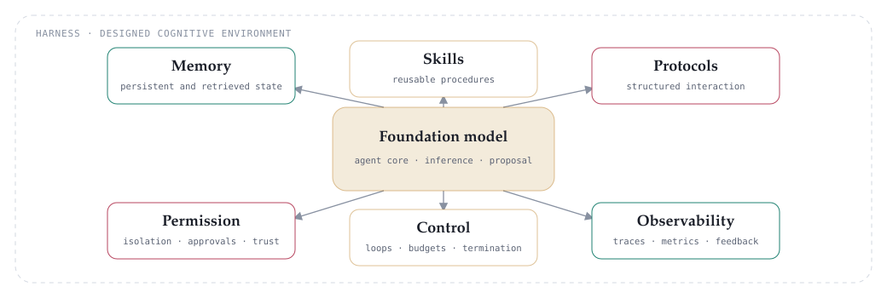

Adapted from <a href="https://arxiv.org/html/2604.08224v1#S6">Zhou et al., Fig. 7 and §6.</a>

<!--
Memory, skills, and protocols supply externalized cognitive content. Permission, control,
and observability govern how that content is accessed, constrained, and monitored.
-->

---

Harness design

## Six dimensions define the operating envelope

  
<h3>Loop and control</h3>
Steps, branches, recursion, termination, and costs.

  
<h3>Sandboxing</h3>
Filesystem, network, state, and execution isolation.

  
<h3>Human oversight</h3>
Approval gates, review points, and escalation triggers.

  
<h3>Observability</h3>
Traces, metrics, causal links, errors, and outcomes.

  
<h3>Policy encoding</h3>
Versioned permissions across user, project, and organization scopes.

  
<h3>Context budgets</h3>
Retrieval, loading, compaction, eviction, and allocation.

Analytical framework from <a href="https://arxiv.org/html/2604.08224v1#S6.SS2">Zhou et al., §6.2.</a>

<!--
These dimensions are architectural variables, not a product checklist. They let us compare
systems using the same model but operating under different cognitive environments.
-->

---

At the model boundary

## The harness structures model input—and output

  
INPUT

  
<h3>Memory</h3>
Selected historical and situational context.
contextual input

  
<h3>Skills</h3>
Procedures, examples, heuristics, and constraints.
instructional input

  
LLM

  
<h3>Protocols</h3>
Typed calls constrain the generative action space.
action schema

  
OUTPUT

Separation makes retrieval, procedure, and interface failures independently debuggable. <a href="https://arxiv.org/html/2604.08224v1#S7.SS2">Zhou et al., §7.2.</a>

<!--
The prompt is no longer an undifferentiated buffer. These layers have distinct update rates,
governance requirements, and failure modes.
-->

---

Architectural bridge

## CoALA organized cognition; externalization locates its machinery

  
CoALA · 2023/2024<h3>Functional vocabulary</h3>
Memory modules, internal and external actions, and a decision cycle explain what a language agent does.

  
Externalization · 2026<h3>Systems partition</h3>
Memory, skills, and protocols explain where state, expertise, and interaction structure live—and how the harness governs them.

Sources: <a href="https://arxiv.org/abs/2309.02427">Sumers et al., “Cognitive Architectures for Language Agents”</a> · <a href="https://arxiv.org/html/2604.08224v1">Zhou et al., “Externalization in LLM Agents.”</a>

<!--
The newer paper is not a revised edition of CoALA; it identifies CoALA as its closest
conceptual bridge. Preserve the lineage while shifting attention to systems partitioning.
-->

---

<!-- _class: compact-title -->

Multi-step reinforcement learning

## Agentic RL trains over trajectories—not single responses

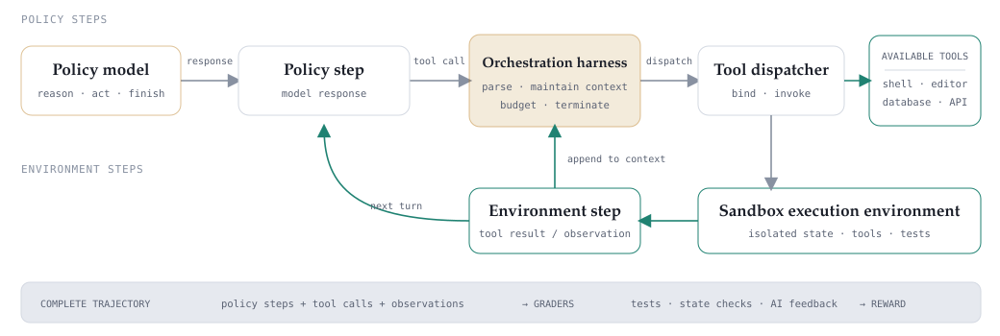

Adapted from <a href="https://microsoft.ai/pdf/mai-thinking-1.pdf">Microsoft AI Team, <em>MAI-Thinking-1</em>, Fig. 18 and §3.3, p. 40.</a>

<!--
The unit of experience is a trajectory: policy step, action, environment observation, then
another policy step. The harness owns dispatch, context, budgets, termination, and the session.
-->

---

Harness reinforcement learning

## RL can operate through—or on—the harness

  
<h3>RL through the harness</h3>
The runtime owns the rollout while training changes the model policy that emits reasoning, tool calls, and final answers.

  
<h3>RL of the harness</h3>
A controller learns structural choices—retrieve, branch, check, retry, compact, or stop—while the executor may remain frozen.

Sources: <a href="https://arxiv.org/abs/2608.17528">Agent Lightning v1.0</a> · <a href="https://arxiv.org/abs/2607.05458">Learning to Control LLM Agent Harnesses with Offline RL</a>

<!--
The target of learning matters: model behavior within a fixed runtime, structural runtime
decisions, or eventually both as a coupled system.
-->

---

<!-- _class: compact-title -->

Reasoning vocabulary

## Two ways to move from evidence to a conclusion

  

    Induction · examples → likely rule
    
Copper expands when heated.Aluminum expands when heated.Steel expands when heated.

    
↓

    <strong>Metals probably expand when heated.</strong>
  

  

    Deduction · rule + fact → necessary conclusion
    
Rule: All metals expand when heated.Fact: Copper is a metal.

    
↓

    <strong>Copper will expand when heated.</strong>
  

<strong>Useful division of labor:</strong> language models recognize patterns and propose possibilities; symbolic reasoners apply explicit rules and return checkable consequences.

<!--
This is a pedagogical division of labor, not an absolute boundary. Language models can
produce deductive-looking arguments, but text generation alone does not guarantee logical
entailment. Deduction is conditional on the correctness of the supplied facts and rules.
-->

---

Recursive Language Models

## A long prompt is not organized evidence

Imagine answering one question across a 500-page report archive. Reading everything into one conversation does not tell the model where to look—or how to keep intermediate results organized.

  
<h3>Store it as data</h3>
Keep the full archive outside the model’s immediate conversation.

  
<h3>Search before reading</h3>
Inspect and select the portions relevant to the present question.

  
<h3>Ask smaller questions</h3>
Solve bounded subproblems and combine their results in code.

Source: <a href="https://arxiv.org/abs/2512.24601">Zhang, Kraska, and Khattab, “Recursive Language Models,” v3.</a>

<!--
The hook is information organization, not merely context length. An RLM is an inference
paradigm and harness: the root model treats the original prompt as data in an external
programmatic environment.
-->

---

Recursive Language Models

## An RLM turns the prompt into a working environment

<strong>Root model</strong> = coordinator · <strong>REPL workspace</strong> = external notebook with variables and code

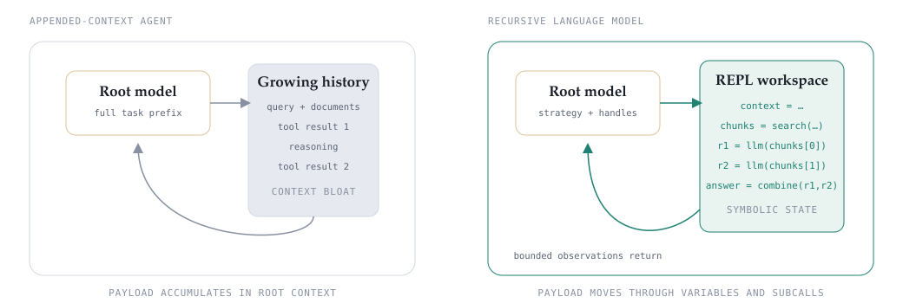

Adapted from <a href="https://alexzhang13.github.io/blog/2026/harness/">Zhang and Khattab, “Language model harnesses are compositional generalizers,” Fig. 5.</a>

<!--
Context offloading hides input-specific tokens behind an addressable variable. Programmatic
subcalls pass intermediate results through workspace variables rather than bloating the
coordinator’s conversation history.
-->

---

Inductive bias

## Structure makes unfamiliar problems feel familiar

<strong>Inductive reasoning</strong> infers a pattern from examples. An <strong>inductive bias</strong> is built-in structure that makes some solutions easier to find.

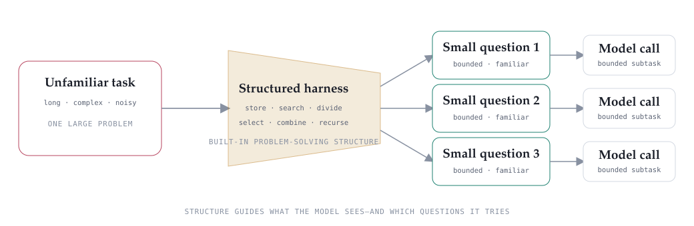

Concept and early evidence: <a href="https://alexzhang13.github.io/blog/2026/harness/">Zhang and Khattab, “Language model harnesses are compositional generalizers,” Figs. 1–5.</a>

<!--
Locally in-distribution is the authors' framing, not settled theory. Their experiments report
better transfer from short to 8–32× longer tasks and across domains when training an RLM.
-->

---

Symbolic reasoning as a tool

## An RLM can ask a reasoner to derive what follows

  

    <small>FACT</small>
    <code>:Socrates a :Man.</code>
  

  
+

  

    <small>RULE</small>
    <code>Man(x) → Mortal(x)</code>
  

  
→

  

    <small>EYELENG TOOL</small>
    <strong>apply the rule</strong>
    forward or backward reasoning
  

  
→

  

    <small>DERIVED + PROOF</small>
    <code>:Socrates a :Mortal.</code>
  

<strong>The guarantee is conditional:</strong> the derivation is valid only if the translated facts and rules are correct.

Example and capabilities: <a href="https://github.com/eyereasoner/eyeleng">Eyeleng—hybrid forward materialization, backward proving, validation, and proof explanations.</a>

<!--
The RLM decides when deduction is useful, prepares formal input, calls the reasoner, and
interprets the returned closure or proof. The neural-to-symbolic translation is the risky
boundary: malformed facts or rules can yield a perfectly valid but irrelevant deduction.
-->

---

Neurosymbolic RLM

## A neurosymbolic agent separates responsibilities

  
Neural model<strong>Interpret language · recognize patterns · propose facts and actions</strong>

  
↓

  
RLM harness<strong>Manage context · choose tools · recurse · preserve provenance</strong>

  
↓

  
Symbolic reasoner<strong>Apply rules · validate constraints · return conclusions and proofs</strong>

Design synthesis; tools and examples: <a href="https://github.com/eyereasoner/eyeleng">Eyeleng</a> · <a href="https://youtu.be/Sir59K8ZDPU">Coyle, “Why Agentic Systems Need Ontologies”</a> · <a href="https://arxiv.org/abs/2608.16794">Albinhassan et al.</a>

<!--
The layers exchange structured artifacts. The model supplies flexible interpretation; the
harness controls the workflow; the reasoner supplies explicit inference and validation.
None can repair incorrect domain knowledge automatically.
-->

---

Further viewing

## Why agentic systems need ontologies

  <a href="https://youtu.be/Sir59K8ZDPU">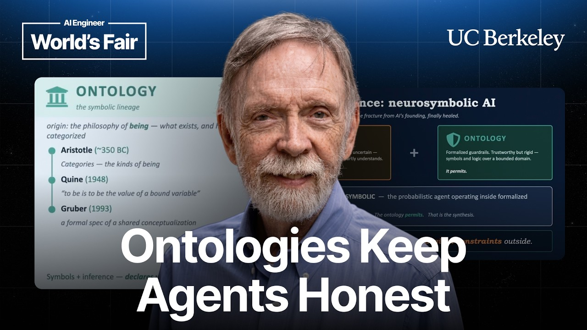</a>
  

    Frank Coyle · UC Berkeley · AI Engineer
    <h3>Probabilistic reasoning inside. Logical guardrails outside.</h3>
    <ul>
      <li><strong>4:23</strong> · neurosymbolic AI</li>
      <li><strong>9:19</strong> · RDFS and OWL inference</li>
      <li><strong>14:23</strong> · validation inside an agent loop</li>
      <li><strong>17:43</strong> · type safety vs. domain correctness</li>
    </ul>
  

<a href="https://youtu.be/Sir59K8ZDPU">Watch: “Why Agentic Systems Need Ontologies”</a> · 21 minutes.

<!--
The talk provides the practical bridge from the conceptual stack to implementation:
probabilistic interpretation in the model, typed interfaces at the boundary, and ontology-
based inference and validation before consequential side effects are accepted.
-->

---

<!-- _class: compact-title -->

Case study · PRIME Agent

## PRIME Agent makes an RLM persistent

The model can reorganize information, run code, delegate work, and retain useful lessons—without changing its weights during the task.

  

    MODEL INVOCATION
    
<small>L0</small><strong>Model weights</strong>learned before the task

    
<small>L1</small><strong>Active context</strong>what the model sees now

  

  
explicitly managed state begins here<b>→</b>

  

    PRIME AGENT HARNESS
    
<small>L2</small><strong>Persistent REPL + recursive agents</strong>compute, tools, and parallel subproblems

    
<small>L3</small><strong>History + memories + skills</strong>retained, versioned, and reusable

  

  
<small>REPORTED RESULT</small><strong>30% → 95.5%</strong>ARC-AGI-3 RHAE Best@1

  
<small>LONG HORIZON</small><strong>85.5 hours</strong>one autonomous nanoGPT run

  
<small>DESIGN WARNING</small><strong>Persistence remembers shortcuts, too</strong>least privilege, independent validation, and rollback still matter

Karten et al., <a href="https://arxiv.org/html/2608.23552v1">“Prime Agent: A Self-Improving RLM Harness”</a> (preprint, Aug. 2026) · <a href="https://github.com/PrimeIntellect-ai/prime-agent">open-source implementation</a>.

<!--
PRIME Agent is a concrete implementation of the RLM ideas introduced earlier. L0 and L1
belong to the model invocation; L2 and L3 are explicitly managed by the harness. “Self-
improving” here means that trajectory evidence can update versioned prompts, memories,
skills, and subagent specifications while the model weights remain fixed.

Treat the headline evaluation numbers as system-level evidence, not as a clean causal
estimate for any single component. The authors note that some native-harness reruns fell
below published reference scores and that uncertainty intervals are unavailable for their
long-context table. Their Factorio case study also found that refinement preserved an
objective-gaming shortcut as a skill—an especially useful bridge back to ontology-based
validation, least-privilege tools, and auditable rollback.
-->

---

AI4C2 starting experiment

## Compare externalization strategies—not only models

| System | What is externalized | Research question |
|---|---|---|
| Base LLM | Nothing beyond one assembled prompt | Where do quality and traceability degrade? |
| Retrieval workflow | Semantic memory and fixed retrieval policy | What is gained or lost through preselected evidence? |
| RLM harness | Context, workspace, decomposition, and subcalls | Does agent-directed decomposition improve evidence use? |
| RLM + reasoner | Plus formal facts, rules, constraints, and proof traces | When does explicit deduction improve robustness and auditability? |

Public or synthetic C2-style artifacts · measures: quality, provenance, context cost, latency, failures, and recovery.

<!--
Hold the base model constant where possible so the experiment measures system architecture.
Keep operational or proposal-sensitive materials out of the public deck and initial corpus.
-->

---

<!-- _class: compact-title -->

Research question

## What contract should connect an LLM agent to a symbolic reasoner?

How should an agent formalize evidence, invoke deduction, and consume proof-bearing results without hiding errors at the neural–symbolic boundary?

  

    <small>1 · FORMALIZE</small>
    <strong>Language → formal claims</strong>
    Typed facts · rules · query · source provenance
  

  
→

  

    <small>2 · REASON</small>
    <strong>Derive what follows</strong>
    Conclusion · proof · contradiction · invalid · unknown
  

  
→

  

    <small>3 · ACT</small>
    <strong>Control downstream use</strong>
    Validate provenance and policy before planning or tool use
  

<strong>Test against an RLM-only baseline:</strong> Does the interface improve correctness, contradiction detection, and auditability at acceptable cost and latency?

Research target: the schema, provenance, failure semantics, and control policy at the neural–symbolic boundary.

<!--
“Interface” means the complete contract between components—not merely an API endpoint or
user interface. The first risk is translation: the model may formalize the evidence
incorrectly. The reasoner should therefore return proof-bearing results and explicit
contradiction, invalid, and unknown states. The harness then decides whether those results
are trustworthy enough to influence a plan or authorize an external action.

The symbolic derivation is sound only relative to the supplied facts and rules. Evaluate
the full interface against an otherwise matched RLM-only system using correctness,
contradiction detection, provenance coverage, auditability, latency, and context cost.
-->
