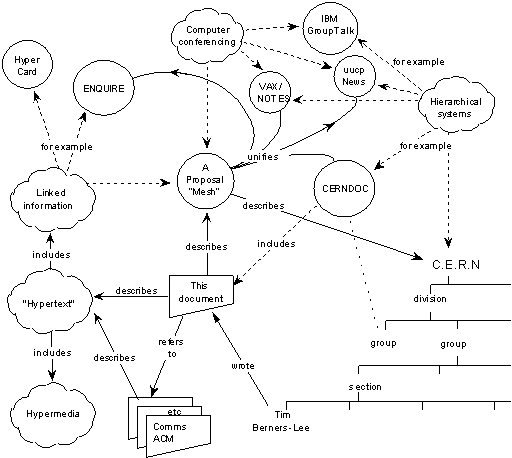

<!-- _class: title -->

SAI · Scientific AI

# WikiMemory

How agents rediscovered an old medium for persistent scientific memory

Charles F. Vardeman II 
Center for Research Computing, University of Notre Dame 
August 31, 2026

<!--
AGENTIC LEARNING NOTES

Slide ID — wikimemory-title
Learning objective — Frame WikiMemory as the rediscovery of an external medium for cumulative scientific memory.
Core claim — The new capability is not model recall; it is an agent that can help maintain an inspectable knowledge environment over time.
Explain — Open on the contemporary rediscovery, give away the architecture immediately, and then ask why such a simple pattern works. The historical arc supplies the answer; the final section asks what scientific use demands beyond a personal second brain.
Misconception — “Memory” here does not mean that an LLM remembers like a person or that a larger context window solves scientific continuity.
Check — In one sentence, what has the agentic community rediscovered?
Source routes — Use the next two slides for the motivating observation and system architecture; use the historical section to explain why the pattern works.
Transition — First give the audience a copy-ready way to explore the deck with an agent.
-->

---

Start here · agent-assisted walkthrough

## Open the deck with your friendly neighborhood agent

  
<small>PRESENTATION</small><a href="https://la3d.github.io/nuggets/projects/sai/updates/2026-08-31/">la3d.github.io/nuggets/projects/sai/updates/2026-08-31/</a>

  

    
Copy and paste into ChatGPT or Codex

    <pre><code>Open this presentation in your browser:
https://la3d.github.io/nuggets/projects/sai/updates/2026-08-31/

Before helping me, inspect the page's raw HTML. Find the embedded
W3C Web Annotation JSON-LD and load its per-slide learning context.

I will navigate the deck myself and may skip around. When I ask a question,
use the slide number or title I provide to select the matching annotation.
Respond conversationally and only to what I ask. Draw on the core claim,
caveats, and sources when useful. Do not lecture through the deck, advance,
or quiz me automatically. If I do not identify the slide, ask which one I am
viewing.</code></pre>
  

<!--
AGENTIC LEARNING NOTES

Slide ID — agentic-walkthrough-bootstrap
Learning objective — Start a learner-controlled agentic dialogue by giving the agent the presentation URL, its embedded learning context, and rules for responding to non-linear questions.
Core claim — The student controls navigation and inquiry; the agent retrieves the relevant slide annotation and responds on demand rather than delivering a linear lecture.
Explain — Invite the learner to copy the prompt and then browse freely. They may skip slides, linger, return, or ask no question at all. When a question includes a slide number or title, the agent selects the matching annotation and uses only the relevant claim, caveat, sources, or check. If the target is ambiguous, the agent asks which slide is in view.
Misconception — The comprehension checks and transitions are optional dialogue resources, not instructions to quiz the learner or advance after every slide.
Check — What information should the learner provide so the agent can ground a question in the correct slide?
Source routes — Open the linked Nuggets presentation and inspect its embedded W3C Web Annotation JSON-LD in the page source.
Transition — Begin the narrative with the Karpathy–Elvis exchange that turned a memory complaint into an agentic design pattern.
-->

---

March 25 → April 4, 2026

## A memory complaint became an agentic design pattern

  
<small>KARPATHY · MAR 25</small><b>Memory distracts</b>an incidental question resurfaces as a permanent “interest”

  
→

  
<small>ELVIS SARAVIA · MAR 25</small><b>Use simple files</b>but tune relevance, discovery, structure, and context

  
→

  
<small>KARPATHY · APR 2–4</small><b>Let an agent maintain a wiki</b>compile sources, answer questions, file outputs, and lint

The surprise was not that a model could remember—it was that an agent could maintain external memory.

<a href="https://x.com/karpathy/status/2036836816654147718">Karpathy on distracting memory</a> · <a href="https://x.com/omarsar0/status/2036848785653895623">Elvis Saravia on methodical file-based memory</a> · <a href="https://x.com/karpathy/status/2039805659525644595">Karpathy, “LLM Knowledge Bases”</a> · <a href="https://gist.github.com/karpathy/442a6bf555914893e9891c11519de94f">the “LLM Wiki” idea file</a>.

<!--
AGENTIC LEARNING NOTES

Slide ID — karpathy-elvis-rediscovery
Learning objective — Reconstruct how a complaint about distracting memory led to an agent-maintained wiki pattern.
Core claim — The important step was moving from indiscriminate remembered facts to methodical maintenance of external files, indexes, and relevance.
Explain — Tell this as a rediscovery, not an invention story. Karpathy begins with a failure mode: personalization memories are over-selected and distract the model. Elvis Saravia replies that simple Obsidian files plus metadata work when memory is tuned methodically. A week later Karpathy describes a working pattern: immutable raw sources, an LLM-maintained Markdown wiki, index-guided question answering, outputs filed back into the corpus, and periodic linting. The April 4 gist turns the observation into a portable idea file that another agent can instantiate.
Misconception — Putting facts in files is not sufficient; selection, discovery, structure, context, and maintenance determine whether external memory helps or distracts.
Check — What changed between “use simple files” and the later LLM Wiki pattern?
Source routes — Follow the three linked X threads and Karpathy’s linked “LLM Wiki” gist on this slide.
Transition — Now reveal the full architecture so the audience can recognize its components throughout the history.
-->

---

The LLM Wiki · TL;DR

## Compile knowledge once; improve the artifact over time

  
<small>RAW /</small><b>immutable sources</b>papers · notes · transcripts · code

  
agent reads + integrates→

  
<small>WIKI /</small><b>persistent synthesis</b>pages · links · contradictions · index

  
agent searches + traverses→

  
<small>WORK</small><b>questions + artifacts</b>answers feed back into the wiki

SCHEMA / AGENTS.md<b>Instructions define ingest, query, citation, maintenance, and linting.</b>

<a href="https://gist.github.com/karpathy/442a6bf555914893e9891c11519de94f">Andrej Karpathy, “LLM Wiki”</a> · <a href="https://www.langchain.com/blog/wiki-memory">Harrison Chase, “Wiki Memory”</a>.

<!--
AGENTIC LEARNING NOTES

Slide ID — llm-wiki-architecture
Learning objective — Explain the roles of raw sources, persistent synthesis, work products, and behavioral instructions in the LLM Wiki loop.
Core claim — Knowledge compounds when an agent repeatedly compiles recoverable evidence into a maintained artifact and files reviewed work back into it.
Explain — Give away the system before the history. Raw is the independently recoverable source of truth. The wiki is the compiled, persistent artifact maintained by the agent. The schema or AGENTS.md is a behavioral contract for ingest, querying, citation, maintenance, and linting. Questions produce files, comparisons, diagrams, or slides that can be reviewed and filed back, so work compounds instead of disappearing into chat history.
Misconception — The wiki is not a replacement for raw evidence; it is a revisable synthesis whose claims must remain traceable to that evidence.
Check — For a newly encountered paper, what belongs in RAW, what belongs in WIKI, and what might be produced as WORK?
Source routes — Follow Karpathy’s linked “LLM Wiki” gist and Harrison Chase’s linked “Wiki Memory” essay.
Transition — The architecture solves a continuity problem that becomes sharper in scientific work.
-->

---

The continuity problem

## Every model call begins now; science began long ago

Research advances by carrying evidence, failed attempts, critique, decisions, and learned procedures across people and time.

  
<h3>Models are episodic</h3>
The active context is powerful but temporary. A new call does not inherit a research history by default.

  
<h3>Science is cumulative</h3>
Claims gain meaning through sources, revisions, contradictions, methods, and negative results.

  
<h3>The system must bridge them</h3>
Continuity has to live somewhere inspectable outside the model invocation.

<!--
AGENTIC LEARNING NOTES

Slide ID — scientific-continuity-problem
Learning objective — Distinguish episodic model context from the cumulative state required by science.
Core claim — Scientific continuity must be preserved in an inspectable environment outside any single model invocation.
Explain — Widen Karpathy’s practical observation into the scientific continuity problem. Research state includes evidence, failed attempts, critique, decisions, procedures, and uncertainty. The engineering task is to preserve that state across calls, sessions, agents, collaborators, and time.
Misconception — A long context window is not automatically institutional memory: it does not by itself provide durable ownership, revision history, provenance, or maintenance.
Check — Name three kinds of scientific state that should survive after the current model call ends.
Source routes — This is the deck’s conceptual framing; connect it backward to the LLM Wiki architecture and forward to the historical continuity systems.
Transition — Ask which earlier knowledge systems already addressed parts of this problem.
-->

---

A longer history

## WikiMemory is a convergence—not a sudden invention

  
<b>Augment thought</b>Memex<i>→</i>NLS / Augment<i>→</i>read–write Web

  
<b>Maintain shared knowledge</b>WikiWikiWeb<i>→</i>Wikipedia<i>→</i>living wiki

  
<b>Own a second brain</b>personal wiki<i>→</i>Markdown vault<i>→</i>knowledge graph

  
↓

  
<strong>Agentic WikiMemory</strong>A model can now navigate, write, refactor, audit, and learn through the medium.

Our synthesis: three historical lineages converge in a harness-operable knowledge substrate.

<!--
AGENTIC LEARNING NOTES

Slide ID — wikimemory-convergence
Learning objective — Identify the three historical lineages that contribute to agentic WikiMemory.
Core claim — WikiMemory is a convergence of associative hypertext, collaborative wiki maintenance, and file-native personal knowledge—not a sudden invention.
Explain — Read the three rows as complementary historical traditions, not one literal lineage. Memex was Bush’s imagined personal device for following associative trails; NLS/Augment was Engelbart’s integrated environment for structured text, links, tools, and collaboration; the read–write Web treats the Web as a medium people can both browse and edit. Wikis add shared maintenance. The “second brain” row adds personal ownership: in a Markdown vault, notes are nodes, links are edges, and metadata can type consequential relationships, so linked notes already form a knowledge graph. Agentic WikiMemory converges these affordances.
Misconception — The arrows organize related developments; they do not claim a single direct genealogy or that each later system consciously inherited every earlier design principle. A graph view is optional: linked notes already form a graph.
Check — What does Memex, NLS/Augment, the read–write Web, wiki maintenance, and the personal Markdown graph each contribute?
Source routes — Treat this as a synthesis map; the next sequence of slides supplies the historical evidence for each row.
Transition — Start with Bush’s idea that associative trails matter more than filing hierarchies.
-->

---

1945 · associative memory

## Bush imagined trails—not a better filing cabinet

  

    “
    
The process of tying two items together is the important thing.

    <small>Vannevar Bush · <em>As We May Think</em></small>
  

  

    
<small>EVIDENCE</small><b>paper</b>
→
    
<small>IDEA</small><b>claim</b>
→
    
<small>TENSION</small><b>conflict</b>
→
    
<small>NEXT</small><b>question</b>

  

Vannevar Bush, <a href="https://www.theatlantic.com/magazine/archive/1945/07/as-we-may-think/303881/">“As We May Think”</a>, 1945.

<!--
AGENTIC LEARNING NOTES

Slide ID — bush-associative-trails
Learning objective — Explain why Bush’s associative trail is more relevant to WikiMemory than a simple filing cabinet metaphor.
Core claim — An associative trail is a saved, revisit-able, branchable, and shareable path through sources, ideas, tensions, and questions—not merely a place to store them.
Explain — In plain language, a trail records how inquiry moved: paper → supported claim → conflicting experiment → resulting question. Bush wrote amid concern that information was growing faster than people could organize and reuse it. His durable design principle was to preserve and pass on paths of association so scientific thought could continue; wiki links later provide a cheap, editable implementation.
Misconception — Bush did not describe the modern Web or modern AI; the Memex matters as an early framing of continuity through associative paths, not as a feature-by-feature prediction.
Check — Construct a four-step associative trail for a research question you know.
Source routes — Follow the linked 1945 Vannevar Bush essay “As We May Think,” especially its discussion of associative indexing and trails.
Transition — Engelbart expands the trail into an entire environment for augmented knowledge work.
-->

---

1960s · augmented knowledge work

## Hypertext was designed as a cognitive environment

  
Engelbart · NLS<h3>Augment the whole workshop</h3>
Structured text, links, views, collaborative editing, tools, and working procedures formed one environment for improving knowledge work.

  
Nelson · Xanadu<h3>Make relationships first-class</h3>
Hypertext, bidirectional links, versioning, transclusion, and visible provenance challenged the document as an isolated page.

<a href="https://dougengelbart.org/content/view/155/">Doug Engelbart Institute, NLS / Augment</a> · <a href="https://www.xanadu.com.au/general/faq.html">Project Xanadu history</a>.

<!--
AGENTIC LEARNING NOTES

Slide ID — engelbarts-cognitive-environment
Learning objective — Distinguish a hypertext feature from a whole cognitive environment for knowledge work.
Core claim — Augmentation emerges from the combination of structured information, tools, collaboration, views, and working procedures.
Explain — Engelbart bridges the history to the harness framing. NLS/Augment was not merely an information store: it designed the surrounding cognitive environment and the procedures through which humans and tools worked together. Nelson’s Xanadu similarly treated relationships, versioning, transclusion, and provenance as first-class concerns.
Misconception — Hypertext is not only clickable text; its knowledge value depends on the larger environment and practices around the links.
Check — Which capabilities surrounding links make NLS/Augment a cognitive environment rather than a document viewer?
Source routes — Follow the linked Doug Engelbart Institute NLS/Augment overview and Project Xanadu history.
Transition — Move from individual augmentation to CERN’s organizational continuity problem.
-->

---

March 1989 · Information Management: A Proposal

## The Web began as a continuity problem at CERN

  <figure class="proposal-map">
    
    <figcaption>Berners-Lee’s original “circles and arrows” map · converted from the W3C archival GIF.</figcaption>
  </figure>
  

    
People rotated through. Projects evolved. Information existed—but could not be found.

    

      
<b>Turnover</b>expertise and project history left with short-term staff

      
<b>Entanglement</b>real work crossed the formal organizational hierarchy

      
<b>Change</b>books and trees became stale as dependencies shifted

    

    
The proposal was for evolving organizational memory—not merely online publishing.

  

<a href="https://www.w3.org/History/1989/proposal.html">Tim Berners-Lee, “Information Management: A Proposal”</a>, March 1989 / May 1990 · <a href="https://www.w3.org/History/1989/Image1.gif">original W3C diagram</a>.

<!--
AGENTIC LEARNING NOTES

Slide ID — web-continuity-problem
Learning objective — Read Berners-Lee’s 1989 proposal and diagram as a response to organizational memory failure at CERN.
Core claim — The Web began as a way to preserve evolving relationships among people, projects, systems, and documents despite turnover and change.
Explain — The proposal begins with high turnover, changing projects, duplicated effort, and technical information that had been recorded but could not be found. Berners-Lee says CERN’s observed working structure was a multiply connected web that evolved with time. The diagram is not a retrospective picture of websites; it maps the information-management problem the Web was meant to address. At this point the working name was “Mesh.”
Misconception — The 1989 diagram is not merely a collection of web pages connected by generic hyperlinks.
Check — Point to one node type and one semantically meaningful relationship in the diagram.
Source routes — Follow Berners-Lee’s linked 1989 proposal and the linked original W3C diagram; read the “Losing Information at CERN” and “Linked information systems” sections.
Transition — Look more closely at the proposal’s data model: the nodes and the links both had types.
-->

---

1989 · the proposed information model

## Berners-Lee proposed typed nodes and links

  

    <small>NODES COULD BE</small>
    
peopleprojectsconceptsdocumentssoftwarehardware

  

  
linked by<strong>→</strong>

  

    <small>LINKS COULD MEAN</small>
    
depends onpart ofmaderefers tousesexample of

  

  remoteheterogeneousnon-centralizedconnect existing datamachine-analyzable

Before the Web had pages at planetary scale, its proposal described a flexible, distributed knowledge graph.

<a href="https://www.w3.org/History/1989/proposal.html">Berners-Lee, “Information Management: A Proposal,” 1989</a> · sections: Linked information systems · CERN Requirements · Data analysis.

<!--
AGENTIC LEARNING NOTES

Slide ID — web-typed-nodes-links
Learning objective — Distinguish typed node categories and typed link predicates in the original Web proposal.
Core claim — Before the Web operated at planetary scale, its proposal described a flexible, distributed, machine-analyzable graph of heterogeneous entities and relationships.
Explain — The proposal explicitly describes generic types of nodes and links, cross-system integration, personal annotations, and automatic analysis for anomalies and topology. This is richer than a collection of documents and anticipates the separation between a knowledge representation and the interfaces or agents that operate over it.
Misconception — Do not retroactively label the 1989 proposal RDF; it precedes RDF and does not specify the later formal model.
Check — Express one relationship from the original diagram as a subject–predicate–object triple.
Source routes — Follow the linked proposal sections “Linked information systems,” “CERN Requirements,” and “Data analysis.”
Transition — Isolate the predicate itself and ask what changes when a link says why two things are connected.
-->

---

1989 → 1999 · from links to relationships

## A typed link says <em>why</em> two things are connected

  
<small>UNTYPED WEB LINK</small>
document<i>— href →</i>claim

Useful for navigation; the machine learns only “links to.”

  
→

  
<small>NAMED RELATIONSHIP</small>
paper<i>— supports →</i>claim

The predicate carries reusable intent.

  
<b>Explain</b>Humans see whether a source supports, criticizes, defines, or depends on another page.

  
<b>Query</b>Ask “what supports this claim?” instead of searching for pages that mention its words.

  
<b>Infer</b>Direction and inverse relations expose dependencies, evidence paths, and affected neighbors.

  
<b>Govern</b>A shared predicate vocabulary can be documented, validated, linted, and evolved.

<a href="https://www.w3.org/1999/11/11-WWWProposal/thenandnow">Dan Brickley, “Nodes and Arcs 1989–1999: The WWW Proposal and RDF: Then and Now”</a> · informal W3C discussion, 1999.

<!--
AGENTIC LEARNING NOTES

Slide ID — typed-links-why
Learning objective — Compare a navigational hyperlink with a named relationship whose predicate can be explained, queried, and governed.
Core claim — A stable predicate such as supports, criticizes, or depends on turns connectivity into reusable intent.
Explain — Brickley’s retrospective calls ordinary href semantics relatively meaningless because the relationship says only “links to.” His key move is to make the predicate a first-class, uniquely identified object. Once wrote, supports, or depends on has stable meaning, graph-pattern questions become possible and different systems can interpret the same edge consistently.
Misconception — A label alone does not make a link trustworthy; predicates still need shared definitions, provenance, validation, and governance. Also, Brickley labels the document a personal, informal interpretation rather than a formal W3C working-group publication.
Check — What question can a supports edge answer that an ordinary link cannot?
Source routes — Follow Dan Brickley’s linked 1999 “Nodes and Arcs” retrospective. Reserve its fuller nodes-and-arcs-to-RDF history for a future deck.
Transition — Return from the semantic model to the human interface: the original Web client supported writing as well as reading.
-->

---

1990 · WorldWideWeb implementation

## The Web began as a read–write medium

  
human<strong>read</strong><strong>write</strong>

  
↔

  
<small>WORLDWIDEWEB · 1990</small><b>browser + editor</b>follow links · create pages · create links

  
↔

  
shared<strong>information space</strong>

Wikis did not invent read–write hypertext; they recovered an ambition the mainstream Web largely left behind.

<a href="https://www.w3.org/History/1989/proposal.html">1989 client/server proposal</a> · <a href="https://www.w3.org/People/Berners-Lee/WorldWideWeb.html">W3C, “WorldWideWeb: the first web client”</a> · <a href="https://www.w3.org/People/Berners-Lee/1997/Directions.html">Berners-Lee, “Realising the Full Potential of the Web”</a>.

<!--
AGENTIC LEARNING NOTES

Slide ID — web-read-write-medium
Learning objective — Explain the original Web’s read–write ambition and the later separation of browsing from editing.
Core claim — The first WorldWideWeb client was a browser-editor; wikis later recovered easy shared editing within the mainstream browser experience.
Explain — Be precise: Berners-Lee invented the Web, not the wiki. The first client could follow links, create pages, and create links. As passive browsers spread, intuitive editing became separated from reading. Wikis later made shared editing simple in an ordinary browser.
Misconception — WikiWikiWeb did not invent read–write hypertext, although it made collaborative maintenance radically accessible.
Check — Which affordance did mainstream browsing lose that wikis later made ordinary again?
Source routes — Follow the linked 1989 client/server proposal, W3C history of the first WorldWideWeb client, and Berners-Lee’s 1997 “Realising the Full Potential of the Web.”
Transition — The wiki’s larger contribution was not merely editing; it was a social process for continuous knowledge maintenance.
-->

---

1995 · WikiWikiWeb

## Wiki made knowledge maintenance a social process

  
<b>Open</b>readers may repair

  
<b>Incremental</b>link what is not written yet

  
<b>Organic</b>structure grows with use

  
<strong>WIKI</strong><small>write · link · refactor</small>

  
<b>Observable</b>changes can be reviewed

  
<b>Convergent</b>duplication is reconciled

  
<b>Mundane</b>few conventions suffice

Ward Cunningham, <a href="https://c2.com/doc/wikisym/WikiSym2006.pdf">“Design Principles of Wiki”</a>, WikiSym 2006.

<!--
AGENTIC LEARNING NOTES

Slide ID — wiki-social-maintenance
Learning objective — Explain wiki as a social and procedural system for continuous knowledge maintenance.
Core claim — A wiki is a corpus plus a culture of writing, linking, reviewing, and refactoring—not merely a markup syntax.
Explain — The key shift is procedural. Openness lets readers repair; observability lets collaborators review; convergence reconciles duplication. “Incremental” is especially important because citing an unwritten page creates an affordance for future elaboration.
Misconception — Installing wiki software or using wiki syntax does not by itself create a maintained knowledge commons.
Check — Which wiki principle turns a missing page into useful future work, and how?
Source routes — Follow Ward Cunningham’s linked “Design Principles of Wiki.”
Transition — At social scale, link syntax must be joined by revision and governance infrastructure.
-->

---

2001 · wiki at social scale

## Links became infrastructure for collective memory

  
<small>EARLY WIKI</small><b>CamelCase</b>lightweight page creation

  
→

  
<small>FREE LINKS</small><b>[[any phrase]]</b>concepts become addressable

  
→

  
<small>MEDIAWIKI</small><b>history + watchlists</b>revision becomes governable

namespacesbacklinksdiscussionrecent changesrevertmaintenance reports

<a href="https://www.mediawiki.org/wiki/MediaWiki_history">MediaWiki history</a> · Wikipedia launched in January 2001; double-bracket “free links” emerged in the early Wikipedia toolchain.

<!--
AGENTIC LEARNING NOTES

Slide ID — wiki-collective-memory
Learning objective — Explain how free links and revision infrastructure made links usable for collective memory.
Core claim — Arbitrary concept naming made knowledge easier to address, while history, watchlists, discussion, and revert made maintenance governable.
Explain — Ward’s first wiki used WikiWords. Double-bracket free links later allowed arbitrary phrases to become page identities without distorting prose. MediaWiki surrounded those links with namespaces, backlinks, discussion, recent changes, watchlists, history, and revert.
Misconception — Double-bracket links were not part of the original WikiWikiWeb, and link syntax alone did not produce Wikipedia’s collective memory.
Check — Why does arbitrary link text matter, and which governance feature makes the resulting edits accountable?
Source routes — Follow the linked MediaWiki history and its account of the early Wikipedia toolchain.
Transition — The next convergence makes this knowledge portable: a single plain-text file can carry both prose and structure.
-->

---

2001–2008 · file-native knowledge

## Plain text became both prose and data

  
<small>YAML · 2001</small><strong>human-readable structure</strong><code>status: contested</code>

  
+

  
<small>MARKDOWN · 2004</small><strong>readable source text</strong><code>## A claim</code>

  
+

  
<small>JEKYLL + GIT · 2008</small><strong>versioned content workflow</strong><code>diff → review → publish</code>

<b>A note can be read as prose, queried as structure, reviewed as a change, and moved without losing its meaning.</b>

<a href="https://yaml.org/spec/1.2.2/">YAML specification history</a> · <a href="https://daringfireball.net/2004/03/introducing_markdown">Gruber, “Introducing Markdown”</a> · <a href="https://tom.preston-werner.com/2008/11/17/blogging-like-a-hacker">Preston-Werner, “Blogging Like a Hacker”</a>.

<!--
AGENTIC LEARNING NOTES

Slide ID — plain-text-prose-data
Learning objective — Explain why YAML, Markdown, and Git together create a useful file-native knowledge substrate.
Core claim — A note can be human-readable prose, machine-queryable structure, and a reviewable versioned artifact at the same time.
Explain — YAML predates Markdown. Jekyll popularized their combination with Git for publishing. The technical result is a portable, tool-friendly, inspectable artifact that can be read directly, processed by scripts, compared as a diff, and moved among tools without surrendering its basic meaning.
Misconception — Jekyll did not start personal knowledge graphs, and YAML-flavored Markdown did not by itself cause the PKG movement.
Check — Name one human operation and one machine operation supported by the same Markdown-plus-YAML note.
Source routes — Follow the linked YAML specification history, Gruber’s “Introducing Markdown,” and Preston-Werner’s “Blogging Like a Hacker.”
Transition — Personal knowledge tools use this cheap, portable substrate to build graph-shaped second brains.
-->

---

2004–2020 · personal networked thought

## The wiki became a personal knowledge graph

  
<small>2004</small><b>TiddlyWiki</b>personal nonlinear notebook

  
→

  
<small>2019</small><b>Roam</b>networked thought + backlinks

  
→

  
<small>2020</small><b>Obsidian</b>local Markdown + graph

  
<h3>PKM “knowledge graph”</h3>
Notes, backlinks, tags, graph views, and emergent associations.

  
<h3>Academic personal KG</h3>
Structured entities, attributes, and relations personally relevant to an individual.

<a href="https://tiddlywiki.com/static/The%2520Story%2520of%2520TiddlyWiki.html">The Story of TiddlyWiki</a> · <a href="https://roamresearch.com/">Roam Research</a> · <a href="https://obsidian.md/about">Obsidian</a> · <a href="https://www.tomkenter.nl/pdf/Personal%20Knowledge%20Graphs%20-%20ICTIR%202019.pdf">Balog &amp; Kenter, 2019</a>.

<!--
AGENTIC LEARNING NOTES

Slide ID — personal-knowledge-graph
Learning objective — Distinguish graph-shaped personal knowledge management from the more formal academic idea of a personal knowledge graph.
Core claim — Personal wikis evolved toward local, linked notes and backlinks, while academic PKGs usually require more explicit entities, attributes, and relations.
Explain — TiddlyWiki, Roam, and Obsidian illustrate the popular second-brain lineage: nonlinear notes, bidirectional links, local files, and graph views. The research literature uses overlapping language but generally assumes a more explicit knowledge representation about entities personally relevant to an individual.
Misconception — A graph visualization of linked notes is not automatically a formal knowledge graph.
Check — Would an Obsidian vault with only untyped wikilinks satisfy the academic PKG definition? What is missing?
Source routes — Follow the linked TiddlyWiki, Roam, and Obsidian histories, then compare them with Balog and Kenter’s 2019 paper.
Transition — Zettelkasten supplies an older and more disciplined account of how a personal note network generates thought.
-->

---

1950s–1990s · Zettelkasten

## Luhmann built a network of arguments—not a filing system

  
<small>ADDRESS</small><b>1/1a2</b>every note has a stable place

  
→

  
<small>BRANCH</small><b>insert nearby</b>extend an argument without reorganizing it

  
→

  
<small>REFER</small><b>cross-link</b>connect distant trains of thought

  
<h3>Entry points, not a master taxonomy</h3>
A selective keyword index and overview cards opened routes into the collection.

  
<h3>Serendipity by construction</h3>
Following references resurfaced ideas in new contexts and helped generate manuscripts.

Johannes F. K. Schmidt, <a href="https://pub.uni-bielefeld.de/download/2942475/2942530">“Niklas Luhmann’s Card Index”</a> · <a href="https://www.uni-bielefeld.de/fakultaeten/soziologie/forschung/luhmann-archiv/pdf/jschmidt_niklas-luhmanns-card-index_-sociologica_2018_12-1.pdf">“The Fabrication of Serendipity”</a>.

<!--
AGENTIC LEARNING NOTES

Slide ID — luhmann-zettelkasten
Learning objective — Identify the mechanisms that made Luhmann’s Zettelkasten a network of arguments rather than a filing taxonomy.
Core claim — Stable addresses, branching insertion, cross-references, selective entry points, and repeated traversal made the card index generative.
Explain — Luhmann’s two card indexes contained roughly 90,000 cards. A permanent address allowed nearby insertion without global reorganization; cross-references connected distant trains of thought; indexes opened selective routes; repeated traversal during writing resurfaced ideas in new contexts.
Misconception — “One idea per note” is a later simplification, not the complete historical definition of Luhmann’s method.
Check — Which mechanism creates serendipity without requiring a master taxonomy?
Source routes — Follow Schmidt’s linked account of Luhmann’s card index and “The Fabrication of Serendipity.”
Transition — Translate the mechanics into file-native form without pretending the furniture itself is the method.
-->

---

Zettelkasten → personal knowledge graph

## A digital PKG preserves the mechanics—not the furniture

  
Card-index mechanism

File-native implementation

  
Card + permanent slip address

Markdown note + stable filename, ID, or URI

  
Branch beside an existing thought

Link a note into the argument it extends

  
Cross-reference distant cards

<code>[[wikilink]]</code>—ideally with the reason for the relation

  
Keyword index + overview cards

Index notes, Maps of Content, properties, and queries

  
Separate bibliographic apparatus

Source notes with citation and provenance metadata

  
Re-encounter by following trails

Backlinks, local graph, search, and deliberate resurfacing

The graph view displays a network; the linking practice creates one worth traversing.

<a href="https://niklas-luhmann-archiv.de/bestand/zettelkasten/tutorial">Niklas Luhmann Archive</a> · <a href="https://obsidian.md/help/links">Obsidian internal links</a>.

<!--
AGENTIC LEARNING NOTES

Slide ID — zettelkasten-to-digital-pkg
Learning objective — Map functional Zettelkasten mechanics onto a file-native personal knowledge graph.
Core claim — Digital tools preserve the method when they support stable identity, contextual insertion, cross-reference, entry points, provenance, and deliberate resurfacing.
Explain — This is an analogy, not a claim that a digital graph reproduces Luhmann’s system. Folders and visualization can help, but neither replaces contextual insertion. The important operation is deciding where a thought participates and recording why. A formal PKG can additionally type consequential relations such as supports, contradicts, derived-from, supersedes, or uses-method.
Misconception — Recreating a card cabinet as folders or displaying a graph does not reproduce the reasoning practice.
Check — Choose one card-index mechanism and show its closest Obsidian implementation plus one way the digital version differs.
Source routes — Follow the linked Niklas Luhmann Archive tutorial and Obsidian internal-links documentation.
Transition — Obsidian provides a particularly inspectable implementation substrate for these mechanics.
-->

---

The file-native substrate

## Obsidian makes the substrate inspectable

  
pages<b>Markdown files</b>
Human-readable, local, portable, scriptable.

  
edges<b>[[wikilinks]]</b>
Cheap references, backlinks, and unfinished destinations.

  
schema<b>YAML properties</b>
Types, status, dates, provenance, and controlled vocabulary.

  
views<b>Folders + queries + graph</b>
Hierarchy, indexes, neighborhoods, and task-specific projections.

The vault supplies the medium; linking and maintenance practices turn it into memory.

<a href="https://obsidian.md/help/links">Obsidian internal links</a> · <a href="https://obsidian.md/help/properties">Obsidian properties</a>.

<!--
AGENTIC LEARNING NOTES

Slide ID — obsidian-substrate
Learning objective — Enumerate the file, link, metadata, and view affordances that make an Obsidian vault inspectable by humans and agents.
Core claim — Local Markdown, wikilinks, YAML properties, and multiple views provide a portable substrate; maintenance practices determine whether it becomes memory.
Explain — Pages give concepts editable local representations; wikilinks create cheap references and backlinks; properties expose machine-selectable state; folders, queries, and graph views offer task-specific projections. The same files can therefore support several memory profiles and toolchains.
Misconception — The graph view is a projection, not the memory method, and Obsidian alone does not supply trustworthy agentic rules or lifecycle semantics.
Check — Which affordance most directly supports auditability, and which supports machine selection?
Source routes — Follow Obsidian’s linked documentation for internal links and properties.
Transition — Add a new actor to this familiar substrate: an agent that performs maintenance work.
-->

---

2026 · a new division of labour

## The new actor is not another reader—it is a maintainer

  
<small>PERSONAL WIKI</small><h3>The human</h3>writesfileslinksrefactorsreviews

  
→

  
<small>AGENTIC WIKI</small><h3>Human + agent</h3>sourcecompilecross-linklintchallenge

WikiMemory is not a new storage idea. It is a new actor in an old medium.

The shift became widely visible through <a href="https://gist.github.com/karpathy/442a6bf555914893e9891c11519de94f">Karpathy’s “LLM Wiki”</a>, April 2026.

<!--
AGENTIC LEARNING NOTES

Slide ID — agent-as-maintainer
Learning objective — Describe the division of labor between a human researcher and an agent maintaining a wiki.
Core claim — The novel actor is an agent that maintains useful structure and continuity within a human-governed medium.
Explain — The agent can find related sources, create or repair links, flag contradictions, summarize what a trail means, and keep paths connected as new evidence arrives. It can also file its execution trajectory so later work can inspect prior attempts rather than restart from scratch. The human remains source selector, question asker, editor, and epistemic judge.
Misconception — Maintenance does not transfer scientific authority to the agent: it may propose, connect, and flag, but it must not silently promote guesses into trusted claims or eliminate human review.
Check — Name one structural task to delegate, one trajectory detail to preserve, and one judgment that should remain explicitly human.
Source routes — Revisit Karpathy’s linked “LLM Wiki” idea file and compare its agent instructions with the earlier personal-wiki lineage.
Transition — Compare maintained synthesis with the dominant query-time retrieval architecture.
-->

---

Compiled memory

## RAG retrieves fragments; WikiMemory preserves synthesis

  
RAG<h3>Rediscover at query time</h3>
chunks<i>→</i>retrieve<i>→</i>answer

Relationships assembled for one response usually disappear with it.

  
WikiMemory<h3>Compile and maintain</h3>
sources<i>→</i>wiki<i>↻</i>work

Entities, tensions, and cross-source synthesis become reusable structure.

<strong>Not a replacement:</strong> raw-source retrieval remains essential for evidence, verification, and details lost in compilation.

<a href="https://arxiv.org/abs/2605.07068">WiCER</a> finds blind compilation can discard critical facts; one or two evaluate–refine iterations recover much of the lost quality.

<!--
AGENTIC LEARNING NOTES

Slide ID — rag-vs-wikimemory
Learning objective — Compare query-time retrieval with persistent, maintained synthesis without treating them as mutually exclusive.
Core claim — RAG grounds a response in retrieved evidence; WikiMemory preserves reusable synthesis, while retaining retrieval beneath it for verification and lost detail.
Explain — Avoid the false binary. A strong architecture keeps raw evidence and may use search or RAG beneath the wiki. The wiki stores maintained entities, relationships, tensions, and synthesis. Retrieval grounds claims and restores details that compilation may discard. WiCER makes that compilation risk empirical.
Misconception — WikiMemory neither replaces RAG nor guarantees that compiled pages preserve every important fact.
Check — When a compiled page omits a critical experimental detail, which layer should recover it and which layer should be repaired afterward?
Source routes — Follow the linked WiCER paper, especially its compilation and evaluate–refine findings.
Transition — Ask what structural affordances make a folder of files operable enough to support this maintenance loop.
-->

---

Why wiki affordances matter

## Structure turns a folder into an operable knowledge space

  
<b>Stable identity</b>A page gives a concept an address that agents and humans can revisit.

  
<b>Traversable relations</b>Links create explicit paths for search, context expansion, and synthesis.

  
<b>Structured metadata</b>Properties expose type, status, provenance, ownership, and lifecycle.

  
<b>Hierarchical scope</b>Folders and indexes bound domains and support progressive disclosure.

  
<b>Revision</b>Diffs and history make memory editable without becoming unaccountable.

  
<b>Human legibility</b>The same artifact can be inspected, challenged, and repaired directly.

Design synthesis. Plain links remain the navigation baseline; add typed predicates when the relation changes query, validation, explanation, or workflow.

<!--
AGENTIC LEARNING NOTES

Slide ID — wiki-affordances
Learning objective — Explain how identity, relations, metadata, scope, revision, and legibility turn files into an operable knowledge space.
Core claim — Wiki affordances make knowledge revisitable, traversable, selectable, reviewable, and directly repairable by both humans and agents.
Explain — Stable pages provide addresses; links provide paths; metadata exposes status and provenance; hierarchy bounds scope; revision makes edits accountable; plain text keeps the artifact inspectable. Typed predicates add value when the distinction changes a query, validation rule, explanation, or workflow.
Misconception — A collection of links is not automatically a sound knowledge graph, and indiscriminate typing can replace link ambiguity with schema noise.
Check — Give one relation that deserves a typed predicate and one ordinary navigational link that does not.
Source routes — This is a design synthesis grounded in the preceding history; connect each affordance to the system that contributed it.
Transition — Hierarchical scope becomes especially important when an agent cannot load the entire corpus into context.
-->

---

Progressive disclosure

## `index.md` turns hierarchy into a context budget

  <pre><code>&#35; Scientific WikiMemory

- [Claims](claims/)
  Synthesized claims, evidence, and status.
- [Methods](methods/)
  Procedures, assumptions, and validation.
- [Experiments](experiments/)
  Runs, outcomes, failures, and decisions.
- [Sources](sources/)
  Papers, data, code, and conversations.</code></pre>
  

    
<b>Survey</b>see the available scopes cheaply

    
<b>Select</b>choose a branch for the present task

    
<b>Expand</b>open its index, then relevant pages

    
<b>Ground</b>reopen raw sources only when needed

  

Context grows with relevance—not with the size of the corpus.

Google Cloud, <a href="https://github.com/GoogleCloudPlatform/knowledge-catalog/blob/main/okf/SPEC.md#8-index-files">Open Knowledge Format v0.2, §8 “Index files”</a>.

<!--
AGENTIC LEARNING NOTES

Slide ID — index-context-budget
Learning objective — Use index.md files as routing layers for progressive disclosure under a limited context budget.
Core claim — A hierarchy becomes agent-operable when each index cheaply reveals available scopes and lets context expand only where the task requires it.
Explain — OKF permits index.md at any directory level. It groups links to concepts or subdirectories and recommends carrying each target’s short description, so a human or agent can see what is available before opening individual documents. The specification calls this progressive disclosure. Our harness interpretation is to survey, select, recursively expand, ground in raw sources when necessary, and stop when the task is sufficiently supported.
Misconception — An index is not an exhaustive table of contents that should always be loaded together with every descendant page.
Check — After reading a root index, what condition tells the agent to stop expanding rather than open another branch?
Source routes — Follow the linked Open Knowledge Format v0.2 specification, section 8 “Index files.”
Transition — Optionally move from hierarchical routing into the local typed neighborhood that an index helps reveal.
-->

---

A maintained neighborhood

## A WikiMemory document is a typed node—not an isolated page

  

    
<small>SOURCE · PAPER</small><b>paper-17</b>reported result

    
<b>supports</b><i>→</i>

    
<small>CLAIM</small><b>claim-7</b>contestable assertion

    
<b>contradicts</b><i>→</i>

    
<small>EXPERIMENT · RUN</small><b>run-042</b>conflicting result

    
<b>motivates</b><i>→</i>

    
<small>OPEN QUESTION</small><b>question-3</b>what changed?

    
<b>revises</b><i>→</i>

    
<small>NEXT ACTION · RUN</small><b>run-043</b>revised experiment

  

  

    
<small>METHOD · PROTOCOL</small><b>protocol-03</b><em>tests</em> the runs under a declared procedure

    
<small>CONCEPT NOTE · HUB</small><b>Compilation gap</b>organizes meaning, scope, and navigation across the neighborhood<em>concerns ↑ the highlighted trail</em>

    
<small>ASSERTION BOUNDARY</small><b>Claims stay separate</b>Contestable assertions keep their own evidence, contradictions, maturity, and review lifecycle.

  

Design synthesis: typed note roles and edges make the inquiry path inspectable; the concept note coordinates the neighborhood rather than absorbing every assertion.

<!--
AGENTIC LEARNING NOTES

Slide ID — wikimemory-neighborhood
Learning objective — Interpret WikiMemory documents as typed nodes in a maintained neighborhood and identify an inquiry trail as one path through that graph.
Core claim — A concept note organizes meaning and navigation, while sources, claims, runs, methods, questions, and next actions retain distinct roles, evidence, and lifecycles.
Explain — Read the highlighted path as a Bush-style inquiry trail: paper-17 supports claim-7; run-042 contradicts it; the conflict motivates question-3; the question leads to revised run-043. Protocol-03 records how runs are tested. The concept note connects this neighborhood without swallowing its contestable assertions; those remain in claim notes where provenance, contradictions, maturity, and review can stay inspectable.
Misconception — A central concept note is not the single source of truth, and drawing many links to it does not make its claims better supported.
Check — Optional exploration: which node should change when run-043 produces a new result, and which neighboring nodes should be reviewed rather than overwritten?
Source routes — Treat this as the deck’s design synthesis of Bush-style trails, typed links, note roles, and scientific provenance; route backward to slides 7 and 22 or forward to the claim-note and typed-edge slides.
Transition — Optional route: zoom into the claim node to separate lifecycle maturity from epistemic status.
-->

---

Claim-note zoom · illustrative fields

## A claim note keeps maturity separate from epistemic status

  <pre class="claim-frontmatter"><code>---
type: claim
maturity: draft
epistemic_status: contested
creator: researcher-or-agent-id
context: inquiry/compilation-gap
supported_by: ["[[paper-17]]"]
contradicted_by: ["[[run-042]]"]
review_after: 2026-10-01
---</code></pre>
  

    
<small>CLAIM</small><b>Compiled knowledge reduces rediscovery.</b>

    
<small>EVIDENCE</small><code>paper-17</code> supports the claim under the reported study conditions.

    
<small>TENSIONS</small><code>run-042</code> contradicts the expected effect in a new evaluation.

    
<small>OPEN QUESTION</small>Which omitted details explain the disagreement?

    
<small>NEXT INQUIRY</small>Revise the protocol, run <code>run-043</code>, then review this claim.

  

<strong>Maturity</strong> asks how developed the note is. <strong>Epistemic status</strong> asks how well the claim is currently supported.

Illustrative Obsidian-compatible claim note—not a canonical schema for llm-wiki-colab or every vault.

<!--
AGENTIC LEARNING NOTES

Slide ID — wikimemory-page-anatomy
Learning objective — Read an illustrative claim note that separates lifecycle maturity from epistemic status while preserving provenance, supporting and contradictory evidence, review timing, and next inquiry.
Core claim — A claim becomes inspectable when machine-readable relations and lifecycle fields remain paired with readable evidence, tensions, questions, and next actions.
Explain — The example labels type, maturity, epistemic status, creator and creation context, supporting paper, contradictory run, and review timing. The prose sections then state the claim, evidence, tension, open question, and next inquiry. Keeping maturity separate from epistemic status prevents “well edited” from being mistaken for “well supported,” while typed relations keep both support and contradiction traversable.
Misconception — These fields are illustrative rather than a universal llm-wiki-colab schema, and structured frontmatter cannot turn an unsupported assertion into dependable knowledge.
Check — Optional exploration: which field should change after an editorial cleanup, which after contradictory evidence, and which after a successful replication?
Source routes — Treat the card as an illustrative claim-note specialization; route backward to the typed neighborhood or forward to the governed transaction and typed-edge slides.
Transition — Optional route: ask how an agent chooses the next useful note among the outgoing links in this neighborhood.
-->

---

Agentic graph navigation · Markov analogy

## The neighborhood is the transition space; the realized sequence is the trail

  

    
<small>TASK / QUERY</small><b>Which evidence challenges claim-7?</b>

    
<small>CURRENT STATE · NOTE</small><b>claim-7</b>outgoing typed links define locally available transitions

    

      
<code>supported_by</code>paper-17

      
<code>contradicted_by</code>run-042<b>selected</b>

      
<code>tested_by</code>protocol-03

      
<code>motivates</code>question-3

    

  

  

    
<small>QUERY-CONDITIONED POLICY / WEIGHTING</small><b>score(next note | task, context, edge semantics, evidence state)</b>choose a useful transition—not merely the most linked node

    
<small>REALIZED TRAIL / TRAJECTORY</small>
concept<i>→</i>claim-7<i>→</i>run-042<i>→</i>question-3

  

<strong>Markov-chain connection:</strong> notes can be modeled as states and typed links as possible transitions. This is a design analogy—not a claim that the current plugin implements one particular Markov algorithm.

<!--
AGENTIC LEARNING NOTES

Slide ID — agentic-neighborhood-navigation
Learning objective — Connect graph navigation to a Markov-style state-transition model without assuming a specific implemented algorithm.
Core claim — A note’s local neighborhood is the available transition space, while a task-conditioned policy or weighting realizes one useful sequence as a trail or execution trajectory.
Explain — Treat notes as states and outgoing typed links as possible transitions. The task, current context, link meaning, provenance, and evidence status can weight which neighboring note is useful next. In the example, a query about challenges favors the contradicted_by edge to run-042, yielding a realized path through the graph. This framing connects to Markov-chain work while remaining implementation-neutral.
Misconception — Link count, centrality, or proximity alone does not establish relevance or truth, and the current llm-wiki-colab materials do not document a single canonical Markov navigation algorithm.
Check — Optional exploration: for a replication-planning query, which outgoing relation should receive more weight, and what evidence-status signal could change that choice?
Source routes — This is a conceptual bridge to state-transition and Markov-chain reasoning; use the deck’s linked llm-wiki-colab sources for implemented graph and lifecycle behavior, not as evidence of a specific navigation algorithm.
Transition — Optional route: move from read-side navigation to the harness that governs graph-changing writes.
-->

---

Harness externalization

## The harness turns a writable vault into a memory system

  
MODEL<b>interpret · propose · synthesize</b>

  
↕

  
HARNESS<b>select · authorize · validate · observe · rollback</b>

  
↓ ↓ ↓

  

    
MEMORY<b>state + knowledge</b>

    
SKILLS<b>reusable procedure</b>

    
PROTOCOLS<b>interaction rules</b>

  

Persistence is an externalized capability; reliability comes from how the harness governs it.

<a href="https://arxiv.org/html/2604.08224v1">Zhou et al., “Externalization in LLM Agents”</a> · <a href="https://openreview.net/attachment?id=e64EcfHp8L&amp;name=pdf">“The Living Wiki”</a> treats the vault schema as a procedural Skill.

<!--
AGENTIC LEARNING NOTES

Slide ID — harness-memory-system
Learning objective — Apply the harness-externalization frame to a writable knowledge vault.
Core claim — Persistence comes from external files, but reliability comes from a harness that selects context, authorizes changes, validates evidence, observes outcomes, and can roll back.
Explain — Files alone do not decide when an agent writes, which evidence is required, whether a change is accepted, or what must be preserved. Provenance keeps claims tied to sources; controlled write scopes and review bound authority; validation tests proposed changes; logs preserve actions and outcomes; rollback reverses changes that fail. Rules, skills, tools, permissions, and gates encode those responsibilities.
Misconception — A persistent folder is not automatically a dependable memory system, and a capable model cannot substitute for lifecycle governance or turn an unsupported guess into a trusted claim.
Check — Optional exploration: for an agent proposing to change a contested claim, name one responsibility at each of select, authorize, validate, observe, and rollback.
Source routes — Follow Zhou et al.’s linked “Externalization in LLM Agents” and the linked “Living Wiki” treatment of vault schema as a procedural skill.
Transition — Optional route: express a write as a governed graph change set and distinguish the generic plugin lifecycle from a stronger vault specialization.
-->

---

Governed write · graph change set

## A WikiMemory write changes a neighborhood—not just one file

  
<small>01 · INTAKE</small><b>New evidence</b>paper · data · run · conversation

  
<small>02 · ORIENT</small><b>Deduplicate + route</b>find the existing neighborhood and note role

  
<small>03 · WRITE</small><b>Create or revise typed notes</b>preserve evidence and contestable claims

  
<small>04 · INTEGRATE</small><b>Add typed + reciprocal links</b>repair both sides of consequential relations

  
<small>05 · COORDINATE</small><b>Update concept · index · log</b>keep navigation and change history coherent

  
<small>06 · VERIFY</small><b>Check provenance + structure</b>scope · links · evidence · structure

  
<small>07 · AUTHORIZE</small><b>Review + commit</b>apply the profile’s write and Git controls

  
<small>08 · DERIVE</small><b>Rebuild graph · permit rollback</b>when the profile defines derived RDF / SHACL

  
<small>GENERIC · <code>llm-wiki-colab</code></small><b>Governed wiki lifecycle</b>orientation · explicit ingest skills · verification gate · index/log integration · Git coordination

  
<small>SPECIALIZATION · VAULT <code>/encode</code></small><b>Stronger typed transaction</b>type routing · maturity + epistemic state · creator/context provenance · review · commit · RDF/SHACL rebuild

 · <a href="https://doi.org/10.5281/zenodo.21213175">Saboia Moreira et al., “Beyond Memory”</a>.

<!--
AGENTIC LEARNING NOTES

Slide ID — llm-wiki-colab-lifecycle
Learning objective — Trace a WikiMemory write as a governed graph change set and distinguish llm-wiki-colab’s generic lifecycle from the vault /encode specialization.
Core claim — A dependable write integrates evidence across notes, links, indexes, logs, verification, authorization, and rollback rather than treating one edited file as the whole transaction.
Explain — The common change-set pattern is to orient and deduplicate, route evidence to an appropriate note role, create or revise typed notes, repair consequential links, update the concept neighborhood plus index and log, verify provenance and structure, authorize and commit, then rebuild derived graph artifacts where the profile defines them. llm-wiki-colab provides a governed wiki lifecycle through orientation, skills, verification, logs, and Git coordination. The vault /encode lane is a stronger specialization with explicit type routing, separate maturity and epistemic state, creator/context provenance, reciprocal integration, review, commit, and RDF/SHACL rebuild.
Misconception — The two lanes do not share one universal schema: llm-wiki-colab is a portable governed lifecycle, while /encode adds repository-specific transaction semantics and derived-graph checks.
Check — Optional exploration: which steps belong to any governed wiki write, and which are specifically stronger commitments of the vault /encode profile?
Source routes — Follow the linked llm-wiki-colab repository and “Beyond Memory” for the generic lifecycle; treat the clearly labeled /encode lane as the author-supplied vault specialization rather than a claim about the plugin’s canonical schema.
Transition — Optional route: zoom into typed-edge compilation as one method used inside a governed change set.
-->

---

Our implementation · typed edges

## Readable predicates compile into an operable graph

  

    <small>AUTHOR IN ORDINARY MARKDOWN</small>
    
<b>Page-level · YAML</b><pre><code>supports: "[[Claim-X]]"
dependsOn: "[[Dataset-Y]]"</code></pre>

    
<b>Contextual · visible inline annotation</b><pre><code>[Claim X](Claim-X)
([*supports*](Edge-Types#supports))</code></pre>

  

  

    <small>COMPILE + CHECK</small>
    
<b>Markdown + YAML</b>forward predicates + plain mentions
<i>↓ extract</i>
    
<b>JSON-LD / RDF</b>stable page and predicate IRIs
<i>↓ materialize</i>
    
<b>Graph operations</b>inverse edges · SHACL · SPARQL

  

  
<b>Evidence</b>source · supports · criticizes

  
<b>Semantics</b>concept · defines · related · mentions

  
<b>Structure</b>up · partOf · outOfScopeFor

  
<b>Evolution</b>extends · precedes · incorporatedInto

  
<b>Dependency</b>dependsOn · feedsInto · resolvedBy

 ·  · forward predicates are authored; inverses are materialized.

<!--
AGENTIC LEARNING NOTES

Slide ID — typed-edge-compilation
Learning objective — Trace a readable relation from Markdown authoring through extraction, RDF representation, validation, and graph querying.
Core claim — Consequential relationships can be promoted to governed predicates while ordinary links remain a low-cost navigation baseline.
Explain — This is progressive formalization. Page-level relations live in YAML; local claims can use a visible GitHub-wiki-compatible predicate annotation; an ordinary link is recorded as mentions. The extractor deduplicates the forms, maps them through a JSON-LD context, materializes inverse edges, validates with SHACL, and supports SPARQL queries such as supports-versus-criticizes.
Misconception — Authors and agents should not assert both directions of a relation; the build owns inverse edges so the two directions cannot silently disagree. Not every mention deserves promotion to a typed predicate.
Check — Where would you author a page-wide dependsOn relation, where would you author a local supports claim, and what does a plain link become?
Source routes — Follow the linked Edge-Types vocabulary and KG build pipeline in llm-wiki-colab.
Transition — Typed edges are one method; skills make the wider scientific maintenance procedures explicit and executable.
-->

---

Our implementation · executable methodology

## Skills make scientific maintenance explicit

  
wiki-source<h3>Integrate external evidence</h3>
Create a source summary, update the existing conceptual neighborhood, record typed relations, repair backlinks, and verify before commit.

  
wiki-experiment<h3>File results honestly</h3>
Preserve configuration, measured metrics, comparison, surprise, negative results, affected claims, code paths, and commit identity.

  
wiki-lint<h3>Maintain corpus integrity</h3>
Surface orphans, dead links, stale claims, missing metadata, one-way references, index gaps, and naming drift.

SUPPORTING SKILLS<b>bootstrap: <code>wiki-init</code> · diagnose: <code>wiki-doctor</code> · collaborate: <code>wiki-ask</code> / <code>wiki-enroll</code></b>

 · each write procedure delegates to a shared Verification Gate.

<!--
AGENTIC LEARNING NOTES

Slide ID — executable-wiki-skills
Learning objective — Differentiate the epistemic obligations of source ingest, experiment filing, and corpus linting.
Core claim — Scientific maintenance becomes inspectable when distinct operations are encoded as explicit skills that converge on a shared verification gate.
Explain — “The agent maintains the wiki” is too vague. Source ingest must integrate external evidence and provenance; experiment ingest must preserve configuration, metrics, comparison, surprise, negative results, code, and commit identity; linting diagnoses structural integrity. Writes integrate rather than append and may update the new page, existing claims, reciprocal links, the index, and the log.
Misconception — One generic maintenance prompt is not equivalent to procedures with different evidence obligations; wiki-lint is diagnostic first rather than permission to rewrite everything automatically.
Check — Which skill should record a negative experimental result, and what information must it preserve that a source summary need not?
Source routes — Follow the linked skills directory in llm-wiki-colab and inspect the shared Verification Gate delegated to by write procedures.
Transition — These local project memories can remain owned by their projects while a federation makes expertise discoverable.
-->

---

Our implementation · LA3D-LLM-Agents

## A federation keeps memory local—and expertise reachable

  
<small>PROJECT AGENT</small><b>repo + wiki + Agent Card</b>source of truth for one research domain

  
publish capability metadata→

  
<small>FEDERATION INDEX</small><b>discover who knows what</b>topics · capabilities · contact

  
select + consult→

  
<small>PEER AGENT</small><b>ask · message · post</b>cross-project collaboration through files

Share an honest capability description; consult the source wiki; avoid copying every project into private context.

<a href="https://github.com/LA3D-LLM-Agents">LA3D LLM Agents organization profile</a> · <a href="https://la3d-llm-agents.github.io/">federation index</a>.

<!--
AGENTIC LEARNING NOTES

Slide ID — federated-project-memory
Learning objective — Explain how local project ownership and federated discovery can coexist.
Core claim — Projects should maintain their own source-of-truth wikis and publish honest capability metadata so peers can discover and consult expertise without copying every corpus into private context.
Explain — Each organization member is a research-project repository paired with a curated wiki and a published Agent Card. The federation index supports discovery. Ask is a synchronous clone-and-consult operation; message is an asynchronous direct mailbox; post is a topical broadcast. Transparent file-based primitives connect expertise while memory stays with the project that owns it.
Misconception — Federation does not require centralizing all project wikis or treating an Agent Card as evidence that every claimed capability is correct.
Check — When should an agent use ask, message, or post, and where should the resulting durable knowledge ultimately be maintained?
Source routes — Follow the linked LA3D LLM Agents organization profile and federation index.
Transition — Place our implementation inside the wider 2026 research cluster now exploring different parts of this system.
-->

---

A field crystallizes · 2026

## Recent work is filling in different parts of the system

  
<b>Representation</b>KarpathyLiving Wiki<em>persistent, linked, inspectable synthesis</em>

  
<b>Compilation</b>WiCERDeepRefine<em>diagnose loss; iteratively repair the artifact</em>

  
<b>Navigation</b>LLM-WikiWikiLoop<em>search, read, traverse, and learn from downstream use</em>

  
<b>Provenance</b>TrajWikiBeyond Memory<em>preserve evolution, failures, and source-grounded revision</em>

  
<b>Learning</b>WikiSkillskills<em>compile experience into reusable procedures</em>

<a href="https://www.langchain.com/blog/wiki-memory">Chase, 2026</a> · <a href="https://arxiv.org/abs/2605.07068">WiCER</a> · <a href="https://arxiv.org/abs/2605.25480">LLM-Wiki</a> · <a href="https://arxiv.org/abs/2607.26604">WikiLoop</a> · <a href="https://arxiv.org/abs/2608.00967">TrajWiki</a> · <a href="https://arxiv.org/abs/2607.24759">Beyond Memory</a> · <a href="https://arxiv.org/html/2608.27454v1">WikiSkill</a>.

<!--
AGENTIC LEARNING NOTES

Slide ID — wikimemory-research-field
Learning objective — Map recent WikiMemory work onto representation, compilation, navigation, provenance, and learning.
Core claim — The 2026 research cluster is filling complementary system dimensions; no single paper or implementation supplies the whole stack.
Explain — The term is no longer only a viral pattern. Work appearing between April and August 2026 addresses persistent representation, compilation loss and refinement, navigation and downstream learning, provenance and revision, and the conversion of experience into reusable procedure. The composition matters more than declaring one winning architecture.
Misconception — A strong result in one row does not solve the other dimensions or establish end-to-end scientific trustworthiness.
Check — Match WiCER, TrajWiki, and WikiSkill to the primary system dimension each contributes.
Source routes — Follow the linked contemporary sources on this slide: Chase, WiCER, LLM-Wiki, WikiLoop, TrajWiki, Beyond Memory, and WikiSkill.
Transition — Before celebrating persistent memory, examine how the same compounding mechanism can amplify error.
-->

---

Memory needs epistemology

## An agent-maintained wiki can compound error, too

  
<b>Weak source</b>enters the corpus
<i>→</i>
  
<b>Unsupported claim</b>looks more settled than its evidence
<i>→</i>
  
<b>Concept synthesis</b>drops the qualification
<i>→</i>
  
<b>Central page</b>gains links and apparent authority
<i>→</i>
  
<b>Later agents</b>repeat and reinforce it

  
<h3>Evidence</h3>
Claim-level provenance + explicit contradictory evidence.

  
<h3>State + review</h3>
Maturity ≠ epistemic status · scheduled re-examination.

  
<h3>Revision</h3>
Supersession + controlled writes preserve what changed and why.

  
<h3>Evaluation</h3>
Probes detect entrenchment; failed changes can roll back.

<a href="https://arxiv.org/abs/2604.12034">“Memory as Metabolism”</a> highlights entrenchment and contradictory evidence · <a href="https://arxiv.org/abs/2608.00967">TrajWiki</a> uses immutable snapshots plus ADD / REVISE / DEPRECATE operations.

<!--
AGENTIC LEARNING NOTES

Slide ID — memory-entrenchment-risk
Learning objective — Explain how an agent-maintained wiki can entrench weak claims and identify controls that interrupt the loop.
Core claim — Persistence and centrality can amplify an unsupported claim when concept synthesis drops qualifications and later agents treat links as authority.
Explain — The failure chain is explicit: a weak source supports an inadequately qualified claim; concept synthesis loses the caveat; the concept page becomes central; later agents repeat it and reinforce the same neighborhood. Controls map to the chain: claim-level provenance and contradictory evidence expose weak support; separate maturity and epistemic status plus scheduled review keep uncertainty visible; supersession and controlled writes preserve revision; evaluation detects downstream repetition; rollback reverses harmful changes.
Misconception — A mature, central, or frequently traversed note is not necessarily true, and a concept note must not absorb contested assertions without their provenance and contradictions.
Check — Optional exploration: choose one arrow in the error loop and name the control that would detect, interrupt, or reverse it before the next agent repeats the claim.
Source routes — Follow the linked “Memory as Metabolism” discussion of entrenchment and contradictory evidence and TrajWiki’s immutable snapshots with ADD, REVISE, and DEPRECATE operations.
Transition — Optional route: with these controls in place, examine how trajectories can be distilled into candidate procedures without treating the distillation as automatically trustworthy.
-->

---

From memory to learning

## WikiSkill compiles experience into validated procedure

  
<small>RAW</small><b>execution traces</b>successes + failures

  
→

  
<small>WIKI</small><b>persistent patterns</b>diagnoses + history

  
→

  
<small>SKILLS</small><b>candidate procedure</b>instructions + resources

  
→<small>validate</small>

  
<b>accept</b>or rollback

<strong>Key result:</strong> persistent wiki knowledge materially improves skill evolution; accepted skills can transfer across models.

Tang et al., <a href="https://arxiv.org/html/2608.27454v1">“WikiSkill: Compiling Agent Experience into Persistent Knowledge for Skill Evolution”</a>, Google Research, Aug. 2026.

<!--
AGENTIC LEARNING NOTES

Slide ID — wikiskill-learning-loop
Learning objective — Distinguish an intellectual trail from an execution trajectory, then trace how trajectories are distilled and validated as candidate procedures.
Core claim — A persistent wiki can help procedures evolve, but distilled experience becomes dependable knowledge only after an outer-loop harness validates it on tasks and can roll it back.
Explain — An intellectual trail records movement through evidence and ideas; an execution trajectory records what an agent tried, which tools or steps it used, and the resulting outcomes and failures. Both preserve continuity, but they are different artifacts. The wiki can distill raw trajectories into candidate reusable lessons, instructions, and resources. Task-level evaluation must then demonstrate improvement, record outcomes, and roll back candidates that fail.
Misconception — A trajectory, plausible wiki summary, or well-written candidate skill is not itself a dependable procedure; distillation can erase context or promote a coincidental success unless validation tests the resulting behavior.
Check — Why is rollback necessary, and what evidence should the acceptance gate inspect?
Source routes — Follow Tang et al.’s linked WikiSkill preprint, especially the ablations on persistent knowledge and cross-model skill transfer; compare this execution path with Bush’s associative trail as a continuity analogy, not a prediction of AI.
Transition — Generalize from learned procedures to a definition of scientific memory that preserves evidence, knowledge, and contestable method.
-->

---

Scientific WikiMemory

## Scientific memory must preserve why we believe—or doubt

  
RAW EVIDENCE<b>papers · data · code · runs · conversations</b><small>immutable or independently recoverable</small>

  
↑ grounded by

  
WIKI KNOWLEDGE<b>claims · entities · methods · tensions · provenance</b><small>maintained, linked, revisioned</small>

  
↑ operationalized as

  
SCIENTIFIC PROCEDURE<b>workflows · checks · skills · decision protocols</b><small>tested, gated, and inspectable</small>

A scientific second brain should not only remember conclusions; it should preserve the routes by which conclusions remain contestable.

<!--
AGENTIC LEARNING NOTES

Slide ID — scientific-wikimemory-definition
Learning objective — Define Scientific WikiMemory as a layered relationship among recoverable evidence, maintained knowledge, and validated procedure.
Core claim — Scientific memory must preserve why claims are believed or doubted so conclusions remain traceable, revisable, and contestable.
Explain — Raw evidence includes papers, data, code, runs, and conversations that remain immutable or independently recoverable. Wiki knowledge maintains claims, entities, methods, tensions, provenance, and revision. Scientific procedures operationalize that knowledge as workflows, checks, skills, and decision protocols that can be tested and inspected.
Misconception — A conclusion-only second brain is not sufficient for science; provenance, negative results, uncertainty, competing interpretations, reproducibility, and human judgment are core memory semantics rather than optional metadata.
Check — Where should a negative result live in the three-layer stack, and how should it affect an existing claim and procedure?
Source routes — This is the deck’s proposed synthesis; route backward to raw/wiki/work, harness externalization, entrenchment controls, and WikiSkill.
Transition — End by turning the definition into an empirical and governance research agenda.
-->

---

SAI research agenda

## What would make WikiMemory scientifically trustworthy?

  
<h3>Representation</h3>
Which page types and relations earn their complexity?

  
<h3>Compilation</h3>
What is safe to synthesize—and what must remain raw?

  
<h3>Retrieval</h3>
When should an agent traverse the wiki or reopen evidence?

  
<h3>Maintenance</h3>
How do we detect staleness, contradiction, and conceptual drift?

  
<h3>Governance</h3>
Which writes are autonomous, reviewed, gated, or prohibited?

  
<h3>Evaluation</h3>
Does the system improve work without hiding failure?

Can an inspectable wiki become the shared memory substrate through which scientists and agents learn together?

<!--
AGENTIC LEARNING NOTES

Slide ID — sai-research-agenda
Learning objective — Translate WikiMemory’s promise into testable research questions about representation, compilation, retrieval, maintenance, governance, and evaluation.
Core claim — Scientific trustworthiness is an empirical and governance program, not a product feature conferred by using Markdown, graphs, or agents.
Explain — Close with a research program rather than a product pitch. A concrete next experiment is to build a scientific WikiMemory profile, compare it with a RAG-only baseline, and evaluate provenance, answer quality, context cost, recovery from error, and visibility of failure.
Misconception — The deck has not established that WikiMemory is already scientifically trustworthy; it has motivated the architecture and the questions required to test it.
Check — Which research question should be tested first, and what observable metric would distinguish improvement from hidden failure?
Source routes — Use the preceding field map and risk slides to design the evaluation; the six cards define the agenda’s major dimensions.
Transition — Invite the audience to choose a first experiment through which scientists and agents can learn together.
-->
